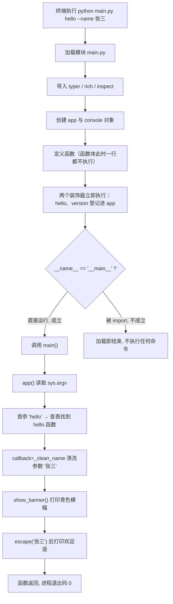
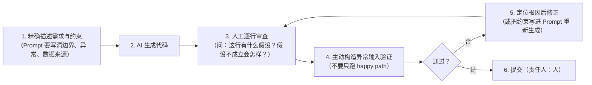
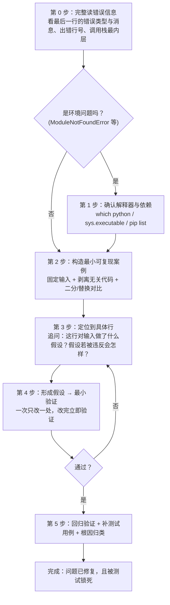

# 实验报告 · Lecture 1：AI Coding Agent CLI 脚手架与首个命令行程序

| 项目 | 内容 |
|---|---|
| 实验名称 | 从零复现 AI Coding Agent —— 环境搭建、Typer/Rich 命令行程序与 AI 协作流程 |
| 课程 | Course Project —— 面向金融的 Python |
| 项目路径 | `/Users/lucius/projects/personal/python-agent-cli` |
| 完成日期 | 2026-09-10 |
| 产出文件 | `main.py`、`init_project.py`、`README.md`、`requirements.txt`、`app/`、`tests/` |

> **阅读说明**
> 第 2、3、5 节要求提供截图。为保证报告在任何环境下都能被复制核对，这三节同时给出两样东西：
> ① `📷 截图位置` 标记（用于粘贴实际截图）；② **可直接复制的真实终端输出**（本机实测原文，非示意）。
> 所有标有"实测"的输出，均在本项目 `.venv`（Python 3.11.16 / typer 0.27.2 / rich 15.0.0）中实际执行得到。

---

## 1. 实验目标

本实验是"从零复现 AI Coding Agent"的第一步，目标不是写出复杂功能，而是**把工程地基打好、把与 AI 协作的方法论跑通**。具体目标如下：

1. **搭建规范的 Python 工程环境**：建立虚拟环境 `.venv`，用 `requirements.txt` 锁定依赖版本，用 `.gitignore` 隔离不该入库的文件，用 Git 分阶段提交。
2. **建立可扩展的项目骨架**：创建 `app/{cli,core,llm,tools,agent}`、`tests/`、`docs/` 等包目录，并为每个 Python 包补上 `__init__.py`，为后续接入 LLM、工具调用（Tool Calling）与 ReAct 循环预留位置。
3. **编写第一个可运行的命令行程序**：用 **Typer** 定义子命令、用 **Rich** 负责终端输出，实现 `hello` 与 `version` 两个子命令，并保证代码符合 PEP8、带类型提示与关键注释。
4. **验证"入口机制"的正确理解**：通过亲手运行，理解 `@app.command()` 装饰器的注册时机、`typer.Option` 与类型提示如何映射为命令行参数、以及 `if __name__ == "__main__"` 入口守卫的作用。
5. **完整体验 AI 协作开发闭环**：按"写 Prompt → AI 生成 → **代码审查** → 定位问题 → 修改并回归验证"的流程走完至少 3 轮迭代，体会 Prompt 表述精度对生成质量的影响。
6. **建立质量意识**：理解"AI 能快速生成代码，但正确性必须由人负责"，掌握至少一种系统性的排错方法。
7. **（挑战目标）编写脚手架脚本**：用 `pathlib` 实现 `init_project.py`，做到**幂等**（重复运行不报错）且**不覆盖已有文件**，使目录结构可一键重建。

---

## 2. 环境配置

### 2.1 环境信息汇总

| 项目 | 版本 / 说明 |
|---|---|
| 操作系统 | macOS 26.6.2（Build 25G83），arm64（Apple Silicon） |
| Python | **3.11.16** |
| 虚拟环境 | `.venv/`（项目内，已加入 `.gitignore`） |
| 虚拟环境解释器路径 | `/Users/lucius/projects/personal/python-agent-cli/.venv/bin/python` |
| Git | **2.55.0** |
| 核心依赖 | typer 0.27.2、rich 15.0.0 |
| 依赖锁定方式 | `requirements.txt`（固定版本号，`pip install -r` 可复现） |

### 2.2 Python 版本

📷 **截图位置 1：Python 版本**
建议截图命令：`python --version`（激活 venv 后）或 `.venv/bin/python --version`

实测输出：

```text
$ .venv/bin/python --version
Python 3.11.16

$ .venv/bin/python -c "import sys; print(sys.executable)"
/Users/lucius/projects/personal/python-agent-cli/.venv/bin/python
```

第二行输出确认了**命令确实在项目虚拟环境内执行**，而不是系统全局 Python —— 这是排查"依赖装了却仍报 `ModuleNotFoundError`"类问题的第一依据。

### 2.3 Git 版本

📷 **截图位置 2：Git 版本**
建议截图命令：`git --version`

实测输出：

```text
$ git --version
git version 2.55.0
```

### 2.4 依赖安装

虚拟环境创建与依赖安装：

```bash
python3.11 -m venv .venv          # 创建虚拟环境
source .venv/bin/activate         # 激活（macOS/Linux）
pip install -r requirements.txt   # 按锁定版本安装依赖
```

`requirements.txt` 内容（7 个包，含 Typer/Rich 的传递依赖）：

```text
annotated-doc==0.0.5
markdown-it-py==4.2.0
mdurl==0.1.2
Pygments==2.21.0
rich==15.0.0
shellingham==1.5.4
typer==0.27.2
```

验证安装结果：

```text
$ pip install -r requirements.txt
Requirement already satisfied: typer==0.27.2 in ./.venv/lib/python3.11/site-packages (from -r requirements.txt (line 7)) (0.27.2)
Requirement already satisfied: rich==15.0.0 in ./.venv/lib/python3.11/site-packages (from -r requirements.txt (line 5)) (15.0.0)
...（其余 5 个包同样为 already satisfied）
```

### 2.5 `.gitignore`

```text
.venv/
__pycache__/
*.pyc
.DS_Store
```

作用：`.venv/`（虚拟环境，本机 34 MB / 2628 个文件）、`__pycache__/`（字节码缓存）、`.DS_Store`（macOS 目录元数据）一律不纳入版本控制。原因见第 7 节思考题 5。

验证忽略规则确实生效：

```text
$ git check-ignore -v .venv
.gitignore:1:.venv/	.venv        # ← 命中第 1 行规则，说明 .venv 已被忽略

$ git ls-files                    # 实际纳入版本控制的文件（.venv 不在其中）
.gitignore
README.md
app/__init__.py
app/agent/__init__.py
app/cli/__init__.py
app/core/__init__.py
app/llm/__init__.py
app/tools/__init__.py
init_project.py
main.py
requirements.txt
tests/__init__.py
```

---

## 3. 项目结构

### 3.1 目录树

📷 **截图位置 3：项目结构**
建议截图命令：`tree -a -I '.venv|__pycache__|.git'`（macOS 无 `tree` 时用下方 `find` 命令）

实测输出（已排除 `.venv/`、`.git/`、`__pycache__/`）：

```text
python-agent-cli/
├── .gitignore                    # 版本控制忽略规则
├── README.md                     # 项目说明（安装 / 运行 / 脚手架）
├── requirements.txt              # 依赖锁定
├── main.py                       # ★ 命令行程序入口（94 行）
├── init_project.py               # ★ 目录脚手架脚本（100 行）
├── app/                          # 应用功能包（后续 Task 逐步填充）
│   ├── __init__.py
│   ├── agent/__init__.py         #   ReAct 循环与 Agent 实现（预留）
│   ├── cli/__init__.py           #   命令实现下沉位置（预留）
│   ├── core/__init__.py          #   配置与核心抽象（预留）
│   ├── llm/__init__.py           #   LLM 客户端（预留）
│   └── tools/__init__.py         #   工具调用实现（预留）
├── docs/                         # 文档
│   └── lec 1 0909工作改进建议.md
└── tests/                        # 测试
    └── __init__.py
```

生成该目录树的命令（可复现）：

```bash
find . -path ./.venv -prune -o -path ./.git -prune -o -name __pycache__ -prune -o -print | sort
```

### 3.2 结构设计说明

| 目录 | 是否需要 `__init__.py` | 说明 |
|---|---|---|
| `app/` 及其子目录 | ✅ 需要 | 会被 Python 当作**包**导入（`import app.llm`），必须含 `__init__.py` |
| `tests/` | ✅ 需要 | 同上，使测试可作为包被收集与互相导入 |
| `docs/` | ❌ 不需要 | 只存放文档资源，不涉及导入 |

`find` 实测确认 7 个 `__init__.py` 均为**空文件**（0 字节）：

```text
$ find app tests -name "*.py" -exec ls -l {} \; | awk '{print $5, $NF}'
0 app/__init__.py
0 app/agent/__init__.py
0 app/cli/__init__.py
0 app/core/__init__.py
0 app/llm/__init__.py
0 app/tools/__init__.py
0 tests/__init__.py
```

导入可用性验证：

```text
$ python -c "import app, app.agent, app.cli, app.core, app.llm, app.tools, tests; print('✅ 全部包导入成功')"
✅ 全部包导入成功
app 包的路径: /Users/lucius/projects/personal/python-agent-cli/app/__init__.py
```

### 3.3 Git 提交记录

实验过程按阶段提交，形成可追溯的演进历史：

```text
$ git log --pretty=format:'%h %ad %s' --date=format:'%Y-%m-%d %H:%M'
c8bfea1 2026-09-10 12:35 feat: add init_project.py scaffold script
21967c8 2026-09-10 12:27 add help subcommand and README
a230d27 2026-09-10 12:17 add hello command with typer and rich
6475b85 2026-09-10 12:10 init project skeleton
```

| 提交 | 内容 | 对应本报告章节 |
|---|---|---|
| `6475b85` | 初始化项目骨架（目录 + `__init__.py` + `requirements.txt` + `.gitignore`） | 第 2、3 节 |
| `a230d27` | 新增 `hello` 子命令（Typer + Rich），含安全性修复 | 第 4 节轮次 1–2 |
| `21967c8` | 新增 `help` 子命令与 `README.md` | 第 4 节轮次 3 |
| `c8bfea1` | 新增 `init_project.py` 脚手架脚本 | 第 4 节轮次 4 |

---

## 4. AI 协作过程（4 轮 Prompt 迭代）

> 每轮均按 **Prompt 原文 → AI 生成代码 → 审查意见 → 修改后代码 → 验证证据** 五段式记录。
> **核心结论先讲**：4 轮中，**只有第 1 轮的 AI 输出可以"基本照用"**，其余 3 轮都需要人工审查才能发现问题或补上关键设计——这正是本实验最想说明的事。

### 轮次 1：生成 `main.py` 骨架（原始 Prompt）

#### ① Prompt（原文）

```text
你是一名资深 Python 工程师。请帮我创建命令行项目 AI Coding Agent CLI。

要求：
1. 使用 Typer + Rich
2. 提供 hello 子命令，接收 --name 参数（默认 Developer）
3. 用 Rich 输出 "AI Coding Agent CLI v0.1" 与个性化欢迎
4. 提供 version 子命令输出版本号
5. 使用 main() 入口与 if __name__ == "__main__"
6. 代码符合 PEP8，附关键行注释
```

#### ② AI 生成代码（关键片段）

```python
import typer
from rich.console import Console

app = typer.Typer(help="AI Coding Agent CLI v0.1")
console = Console()


def show_banner() -> None:
    """打印程序名称与版本号横幅。"""
    console.print("[bold cyan]AI Coding Agent CLI v0.1[/bold cyan]")


@app.command()
def hello(
    name: str = typer.Option("Developer", "--name", "-n", help="要问候的名字"),
) -> None:
    """向指定用户打招呼（--name 可自定义名字）。"""
    show_banner()
    console.print(f"Hello, {name}! Welcome to AI Coding Agent CLI.")


@app.command()
def version() -> None:
    """输出版本号。"""
    console.print("AI Coding Agent CLI v0.1")


def main() -> None:
    app()


if __name__ == "__main__":
    main()
```

#### ③ 审查意见

| 编号 | 问题 | 判定 |
|---|---|---|
| R1-1 | 符合全部 6 条要求：Typer + Rich、`hello` 带 `--name` 默认 `Developer`、`version` 子命令、`main()` 入口、PEP8、关键注释 | ✅ 通过 |
| R1-2 | 名称与版本号字面量 `"AI Coding Agent CLI v0.1"` 在 4 处重复出现，将来改版本号需全文替换，极易漏改 | ⚠️ 需改 |
| R1-3 | 入口守卫里调用 `main()` 正确，`app`/`console` 为模块级单例，未破坏 Typer 的注册机制 | ✅ 通过 |

**修改动作**：把名称与版本号提取为模块级常量 `APP_NAME`、`VERSION`，各处改用 f-string 引用，消除重复字面量。

#### ④ 修改后代码

```python
APP_NAME = "AI Coding Agent CLI"
VERSION = "0.1"

app = typer.Typer(help=f"{APP_NAME} v{VERSION}")
console = Console()


def show_banner() -> None:
    """打印程序名称与版本号横幅。"""
    console.print(f"[bold cyan]{APP_NAME} v{VERSION}[/bold cyan]")
```

#### ⑤ 验证证据

```text
$ python main.py hello --name 张三
AI Coding Agent CLI v0.1
Hello, 张三! Welcome to AI Coding Agent CLI.
```

与实验要求的预期输出**逐字节一致**（含结尾换行）。

---

### 轮次 2：代码审查发现"Rich 标记注入"缺陷（本实验最关键的一轮）

轮次 1 的代码"看起来完全正常"，但**只有主动构造异常输入去试探，才能暴露隐藏缺陷**。以下为审查 Prompt 与实测过程。

#### ① Prompt（原文）

```text
请检查main代码，输出：
1. 潜在 Bug
2. 代码风险
3. 改进建议
```

#### ② AI 生成代码（问题代码，轮次 1 的原始写法）

```python
@app.command()
def hello(
    name: str = typer.Option("Developer", "--name", "-n", help="要问候的名字"),
) -> None:
    """向指定用户打招呼（--name 可自定义名字）。"""
    show_banner()
    console.print(f"Hello, {name}! Welcome to {APP_NAME}.")   # ← 问题在这行
```

#### ③ 审查意见（实测复现，非推测）

用最小复现脚本执行原写法，得到三个真实结果：

**Bug A：未配对标记导致程序崩溃（退出码 1）**

```text
$ python original.py hello --name '[/bold]'
╭───────────────────── Traceback (most recent call last) ──────────────────────╮
│ .../rich/markup.py:167 in render                                            │
│   167 │   │   │   │   │   │   raise MarkupError(                            │
╰──────────────────────────────────────────────────────────────────────────────╯
MarkupError: closing tag '[/bold]' at position 7 doesn't match any open tag
$ echo $?
1
```

**根因**：`console.print()` 默认把字符串当作 **Rich 标记语法**解析。用户传入的 `[/bold]` 被当作"样式结束标签"，但前面没有对应的开始标签，Rich 直接抛 `MarkupError`，整个命令崩溃。

**Bug B：合法标记被静默"吞掉"，输出被篡改**

```text
$ python original.py hello --name '[bold]x'
AI Coding Agent CLI v0.1
Hello, x! Welcome to AI Coding Agent CLI.        # ← 用户输入的 [bold] 消失了！
```

用户输入的是名字 `[bold]x`，程序却输出了 `x`。**错误是静默的**：没有异常、退出码 0，如果不去核对原文，根本不会发现数据被改写。

**Bug C：空/纯空白名字未被拦截**

```text
$ python original.py hello --name '   '
AI Coding Agent CLI v0.1
Hello,    ! Welcome to AI Coding Agent CLI.      # ← 输出残缺的"Hello,    !"
```

**审查结论**：三个问题的**共同根因**是"**把不可信的用户输入直接拼进有语义的标记字符串**"。修法分两层——输出侧对用户输入转义，输入侧做校验清洗。

#### ④ 修改后代码

```python
from rich.markup import escape          # 新增导入


def _clean_name(value: str) -> str:
    """去掉首尾空白，并拒绝空名字。"""
    name = value.strip()                # 去掉首尾空白
    if not name:                        # 空字符串是"假值"
        raise typer.BadParameter("名字不能为空")
    return name


@app.command()
def hello(
    name: str = typer.Option(
        "Developer",
        "--name",
        "-n",
        help="要问候的名字",
        callback=_clean_name,           # Typer 解析出参数后先调用它做校验/清洗
    ),
) -> None:
    """向指定用户打招呼（--name 可自定义名字）。"""
    show_banner()
    # escape() 把用户输入里的 [xxx] 转义成普通文本，避免被 Rich 当成样式标记解析
    console.print(f"Hello, {escape(name)}! Welcome to {APP_NAME}.")
```

#### ⑤ 验证证据（修复前后对照）

| 输入 | 修复前 | 修复后 |
|---|---|---|
| `--name 张三` | ✅ 正常 | ✅ 正常（未回归） |
| `--name '[/bold]'` | ❌ `MarkupError` 崩溃，退出码 1 | ✅ `Hello, [/bold]! ...`，退出码 0 |
| `--name '[bold]x'` | ⚠️ 被静默篡改为 `Hello, x!` | ✅ 原样输出 `Hello, [bold]x!` |
| `--name '   '` | ⚠️ 输出 `Hello,    !` | ✅ 报错"名字不能为空"，退出码 2 |
| `--name '  Li Ming  '` | ⚠️ 保留首尾空格 | ✅ 自动修剪为 `Hello, Li Ming!` |

实测输出：

```text
$ python main.py hello --name '[/bold]'
AI Coding Agent CLI v0.1
Hello, [/bold]! Welcome to AI Coding Agent CLI.

$ python main.py hello --name '   '
Usage: main.py hello [OPTIONS]
Try 'main.py hello --help' for help.
╭─ Error ──────────────────────────────────────────────────────────────────────╮
│ Invalid value for '--name' / '-n': 名字不能为空                              │
╰──────────────────────────────────────────────────────────────────────────────╯
```

> **本轮的实验意义**：这段代码通过了轮次 1 的全部"正常路径"验收（`--name 张三` 输出完全正确），却在异常输入下崩溃或静默篡改数据。**"跑通示例命令"与"代码正确"之间隔着一次主动代码审查。**

---

### 轮次 3：新增 `help` 子命令（体会 Prompt 表述精度的影响）

本轮是实验特意设计的"Prompt 对比实验"：**同一个需求，两种表述方式，会得到质量截然不同的实现。**

#### ① Prompt（两种写法对比）

**❌ 表述 A（不合格）**

```text
给项目加一个 help 子命令，显示 hello 和 version 的说明。
```

**✅ 表述 B（合格，实际采用）**

```text
请给 main.py 增加一个 help 子命令，输出命令列表与说明。要求：
1. 命令说明优先取 @app.command(help=...) 参数，其次取函数 docstring 的第一行
2. 不要硬编码命令清单，直接从 Typer 的命令注册表动态读取，
   以后新增子命令时 help 输出能自动更新，不需要再改这个函数
3. 用 Rich 表格展示，两列：命令名、说明
4. 被标记为 hidden 的命令不要显示
```

**为什么表述 A 会得到坏代码**：它只说了"显示 hello 和 version 的说明"，AI 会**照字面理解**，写出硬编码两个命令名与说明的实现。这种实现当下能跑通、看起来完美，但**每新增一个子命令都必须回来手改这个函数，漏改不报错**——是典型的"技术债种子"。

**为什么表述 B 能得到好代码**：它明确了两件事——**数据来源**（命令注册表，而非人工清单）与**取值优先级**（`help=` 参数 > docstring 首行）。AI 才能准确选中 `CommandInfo` 的对应字段，实现"永不过期"的版本。

#### ② AI 生成代码

```python
import inspect
from typer.models import CommandInfo
from rich.table import Table


def _command_name(command_info: CommandInfo) -> str:
    """取命令名：装饰器显式指定时用它，否则退回函数名。"""
    return command_info.name or command_info.callback.__name__


def _command_summary(command_info: CommandInfo) -> str:
    """取一句话说明：优先用装饰器 help= 参数，否则用函数 docstring 的首行。"""
    text = command_info.help or inspect.cleandoc(command_info.callback.__doc__ or "")
    lines = [line for line in text.splitlines() if line.strip()]
    return lines[0].strip() if lines else "（暂无说明）"


@app.command("help")  # 显式命名：函数名 help_command 避免遮蔽内置的 help()
def help_command() -> None:
    """显示所有可用命令及其说明。"""
    show_banner()
    table = Table(title="可用命令", title_style="bold", header_style="bold cyan")
    table.add_column("命令", style="green", no_wrap=True)
    table.add_column("说明")
    for command_info in sorted(app.registered_commands, key=_command_name):
        if command_info.hidden:
            continue
        table.add_row(_command_name(command_info), _command_summary(command_info))
    console.print(table)
    console.print("用 [bold]python main.py <命令> --help[/bold] 查看某个命令的详细用法。")
```

#### ③ 审查意见

| 编号 | 问题 / 检查点 | 结论 |
|---|---|---|
| R3-1 | 函数名若写成 `def help()` 会**遮蔽 Python 内置的 `help()` 函数** | ✅ 已规避：用 `@app.command("help")` 显式命名命令，函数名取 `help_command` |
| R3-2 | `help` 子命令是否会破坏 Typer 原生 `--help`？ | ✅ 不会，二者可共存（详见验证） |
| R3-3 | 说明取值优先级是否真的生效？ | ✅ 实测：`help=` 参数优先于 docstring |
| R3-4 | 新增子命令时 `help` 输出是否自动更新？ | ✅ 实测通过 |
| R3-5 | `hidden=True` 的命令是否被正确跳过？ | ✅ 实测通过 |
| R3-6 | docstring 的多行缩进是否会导致输出错乱？ | ✅ 用 `inspect.cleandoc()` 处理，与 Typer 自身渲染算法一致 |

#### ④ 修改后代码

审查后仅补充了两个细节：`inspect.cleandoc()` 处理 docstring 缩进、`hidden` 过滤，其余保持生成结果。

#### ⑤ 验证证据

**命令列表输出**：

```text
$ python main.py help
AI Coding Agent CLI v0.1
                       可用命令                        
┏━━━━━━━━━┳━━━━━━━━━━━━━━━━━━━━━━━━━━━━━━━━━━━━━━━━━┓
┃ 命令    ┃ 说明                                      ┃
┡━━━━━━━━━╇━━━━━━━━━━━━━━━━━━━━━━━━━━━━━━━━━━━━━━━━━┩
│ hello   │ 向指定用户打招呼（--name 可自定义名字）。 │
│ help    │ 显示所有可用命令及其说明。                │
│ version │ 输出版本号。                              │
└─────────┴───────────────────────────────────────────┘
用 python main.py <命令> --help 查看某个命令的详细用法。
```

**"自动同步"验证**（动态注册新命令后，无需改 `help` 代码即自动出现；`help=` 优先级与 `hidden` 过滤同时验证）：

```text
$ python - <<'PY'  # 临时注册两个命令 + 一个隐藏命令后调用 help_command()
@main.app.command()
def zzz_temp() -> None:
    """临时新增的命令，用于验证自动同步。"""

@main.app.command(help="显式 help= 参数优先于 docstring")
def aaa_temp() -> None:
    """这段 docstring 不应被展示。"""

main.app.registered_commands.append(
    CommandInfo(name="secret", callback=lambda: None, hidden=True)
)
main.help_command()
PY

AI Coding Agent CLI v0.1
                        可用命令                        
┏━━━━━━━━━━┳━━━━━━━━━━━━━━━━━━━━━━━━━━━━━━━━━━━━━━━━━┓
┃ 命令     ┃ 说明                                      ┃
┡━━━━━━━━━━╇━━━━━━━━━━━━━━━━━━━━━━━━━━━━━━━━━━━━━━━━━┩
│ aaa_temp │ 显式 help= 参数优先于 docstring           │  ← help= 覆盖了 docstring ✅
│ hello    │ 向指定用户打招呼（--name 可自定义名字）。 │
│ help     │ 显示所有可用命令及其说明。                │
│ version  │ 输出版本号。                              │
│ zzz_temp │ 临时新增的命令，用于验证自动同步。        │  ← 新命令自动出现 ✅
└──────────┴───────────────────────────────────────────┘
用 python main.py <命令> --help 查看某个命令的详细用法。
                                      ↑ 注册的 secret 命令因 hidden=True 未出现 ✅
```

**原生 `--help` 未被破坏**：

```text
$ python main.py --help
╭─ Commands ───────────────────────────────────────────────────────────────────╮
│ hello    向指定用户打招呼（--name 可自定义名字）。                           │
│ version  输出版本号。                                                        │
│ help     显示所有可用命令及其说明。                                          │
╰──────────────────────────────────────────────────────────────────────────────╯
```

> 说明：自定义 `help` 按**字母序**排列（hello / help / version），Typer 原生 `--help` 按**注册顺序**排列（hello / version / help）。这是 `sorted(..., key=_command_name)` 带来的可见差异，属于设计选择，不影响功能。

---

### 轮次 4：编写脚手架脚本 `init_project.py`（挑战题）

#### ① Prompt（原文，含失败经验的迭代）

**❌ 第一版 Prompt（不完整）**

```text
写一个 init_project.py，运行后创建 app/、tests/ 等目录和空的 __init__.py。
```

**审查该述的漏洞**：没说明"**目录已存在时怎么办**"。AI 很可能写出 `mkdir()` 裸调用（第二次运行直接 `FileExistsError`）或 `__init__.py` 用 `write_text("")` 直接覆写（**会清空已写好的包代码**）。对脚手架脚本而言，这两点是致命的。

**✅ 第二版 Prompt（实际采用，补上约束）**

```text
请编写 init_project.py 项目脚手架脚本，用 pathlib 实现，要求：
1. 运行后自动创建目录结构：app、app/agent、app/cli、app/core、app/llm、app/tools、
   tests（需含 __init__.py），以及 docs（不需要 __init__.py）
2. 必须幂等：重复运行不报错、不重复创建。用 Path.mkdir(exist_ok=True) 实现
3. 已存在的文件绝不覆盖，尤其是 __init__.py 里已写的代码必须原样保留
4. 用 Path(__file__).resolve().parent 定位项目根目录，而不是 os.getcwd()，
   保证从任意目录执行都能正确定位
5. 零第三方依赖，只用标准库（脚本要在 pip install 之前就能运行）
6. 输出每个目录/文件的处理结果（新建 / 已存在），结尾给出数量小结
```

#### ② AI 生成代码（关键片段）

```python
from pathlib import Path

PROJECT_ROOT = Path(__file__).resolve().parent

PACKAGE_DIRS: tuple[str, ...] = (
    "app", "app/agent", "app/cli", "app/core", "app/llm", "app/tools", "tests",
)
PLAIN_DIRS: tuple[str, ...] = ("docs",)


def create_directory(path: Path) -> bool:
    """创建目录（含缺失的父目录）。"""
    is_new = not path.is_dir()                 # 先记录"是否本来就存在"
    path.mkdir(parents=True, exist_ok=True)    # exist_ok=True 是幂等的关键
    return is_new


def create_init_file(path: Path) -> bool:
    """创建空的 __init__.py；若文件已存在则原样保留（绝不覆盖已有代码）。"""
    if path.exists():
        return False                           # 守卫：已存在就直接返回，不写任何东西
    path.touch()
    return True
```

#### ③ 审查意见

| 编号 | 问题 / 检查点 | 结论 |
|---|---|---|
| R4-1 | `mkdir(parents=True, exist_ok=True)` 是否都写了？ | ✅ 缺 `exist_ok=True` 则第二次运行崩溃；缺 `parents=True` 则删除 `app/` 后无法一次建好 `app/llm` |
| R4-2 | `exist_ok=True` 会吞掉"是否已存在"的信息，如何知道该打印"新建"还是"已存在"？ | ✅ 用 `is_new = not path.is_dir()` **提前记录**，保证日志与实际动作基于同一事实 |
| R4-3 | `__init__.py` 是否可能被覆盖？ | ✅ 有 `path.exists()` 守卫，已存在即跳过 |
| R4-4 | 从其他目录执行是否会建错位置？ | ✅ 用 `Path(__file__).resolve().parent`，实测从 `/tmp` 执行仍正确定位 |
| R4-5 | 是否引入了 rich 等第三方依赖？ | ✅ 无，只用 `pathlib`（脚本必须在装依赖前就能跑） |
| R4-6 | 是否会误改 `main.py` / `README.md`？ | ✅ 脚本只处理目录与 `__init__.py`，已用文件指纹实测确认 |

#### ④ 修改后代码

审查未发现需要修改的逻辑缺陷，脚本一次成型。完整实现见项目根目录 `init_project.py`。

#### ⑤ 验证证据（7 项测试全部通过，含实验要求的检查点）

**检查点：删除 `app/` 后运行脚本，结构被重建**

```text
$ rm -rf app && rm -f tests/__init__.py

$ python init_project.py
项目根目录: /Users/lucius/projects/personal/python-agent-cli
开始检查目录结构 ...
  [已存在]   docs/
  [新建目录] app/
  [新建文件] app/__init__.py
  [新建目录] app/agent/
  [新建文件] app/agent/__init__.py
  [新建目录] app/cli/
  [新建文件] app/cli/__init__.py
  [新建目录] app/core/
  [新建文件] app/core/__init__.py
  [新建目录] app/llm/
  [新建文件] app/llm/__init__.py
  [新建目录] app/tools/
  [新建文件] app/tools/__init__.py
  [已存在]   tests/
  [新建文件] tests/__init__.py
完成：新建目录 6 个，新建文件 7 个。
$ echo $?
0
```

**完整测试矩阵**：

| # | 测试项 | 命令 | 结果 |
|---|---|---|---|
| 1 | 结构完整时运行（幂等） | `python init_project.py` | `新建目录 0 个，新建文件 0 个` + `目录结构已完整，无需改动。`，退出码 0 ✅ |
| 2 | **删 `app/` 后重建（检查点）** | `rm -rf app` → `python init_project.py` | 6 目录 + 7 文件，退出码 0 ✅ |
| 3 | 与删除前逐项比对 | `diff -r 备份/app app` | 目录树与文件内容完全一致 ✅ |
| 4 | 重建后再运行 | `python init_project.py` | 0 新建，幂等 ✅ |
| 5 | 删除嵌套目录 `app/tools/` | `rm -rf app/tools` → 运行 | 目录与 `__init__.py` 一起补齐 ✅ |
| 6 | 从 `/tmp` 执行 | 绝对路径调用脚本 | 正确输出项目根目录 ✅ |
| 7 | 根目录文件指纹 | `shasum main.py` 前后比对 | 哈希不变，脚本未误改代码 ✅ |

**测试 3 实测输出**：

```text
$ diff -r /tmp/scaffold_backup/app app && echo "✅ app/ 目录树与备份完全一致"
✅ app/ 目录树与备份完全一致
$ cmp /tmp/scaffold_backup/tests_init.py tests/__init__.py && echo "✅ tests/__init__.py 与备份一致"
✅ tests/__init__.py 与备份一致
```

**测试 7 实测输出**（步骤开始前 → 结束后，哈希完全一致）：

```text
42b0ed651189e8dab5b44211e5e07abb26daef5e  main.py
854afcf800be6af262a2b4fbbdbfd0bf0babe0dc  README.md
a8fca8ac6a27b572b7dce9dff6e497a29bd57e0a  requirements.txt
```

**"绝不覆盖"专项测试**：往 `app/llm/__init__.py` 写入自定义代码后运行脚本：

```text
$ echo 'MY_CUSTOM_CODE = 1' > app/llm/__init__.py
$ python init_project.py | grep llm
  [已存在]   app/llm/__init__.py
$ cat app/llm/__init__.py
MY_CUSTOM_CODE = 1              # ← 内容原样保留，未被清空 ✅
```

---

### 轮次小结

| 轮次 | 任务 | AI 一次输出可用度 | 人工审查发现的实质问题 |
|---|---|---|---|
| 1 | `main.py` 骨架 | 高（功能全对） | 4 处重复字面量（可维护性） |
| 2 | 代码审查 → 修复 | — | **崩溃 + 静默数据篡改**（正确性缺陷，示例命令无法暴露） |
| 3 | `help` 子命令 | 取决于 Prompt 质量 | 硬编码清单 vs 动态读取（架构缺陷）；函数名遮蔽内置 `help()` |
| 4 | `init_project.py` | 高（Prompt 已含约束） | 若 Prompt 未说明幂等/不覆盖，将产生破坏性脚本 |

---

## 5. 运行结果

### 5.1 `hello` 子命令

📷 **截图位置 4：`hello` 子命令运行截图**
建议截图命令：`python main.py hello` 与 `python main.py hello --name 张三`

**（1）默认名字**

```text
$ python main.py hello
AI Coding Agent CLI v0.1
Hello, Developer! Welcome to AI Coding Agent CLI.
```

**（2）指定名字（实验要求的预期输出）**

```text
$ python main.py hello --name 张三
AI Coding Agent CLI v0.1
Hello, 张三! Welcome to AI Coding Agent CLI.
```

✅ 与实验第 6.3 节给出的预期输出**完全一致**（已用 `diff` 逐字节比对，含结尾换行）。

**（3）短选项 `-n` 等价写法**

```text
$ python main.py hello -n 张三
AI Coding Agent CLI v0.1
Hello, 张三! Welcome to AI Coding Agent CLI.
```

### 5.2 `version` 子命令

📷 **截图位置 5：`version` 子命令运行截图**
建议截图命令：`python main.py version`

```text
$ python main.py version
AI Coding Agent CLI v0.1
```

✅ 逐字节比对通过（`diff` 无差异，退出码 0）。

### 5.3 扩展子命令 `help`（选做任务）

```text
$ python main.py help
AI Coding Agent CLI v0.1
                       可用命令                        
┏━━━━━━━━━┳━━━━━━━━━━━━━━━━━━━━━━━━━━━━━━━━━━━━━━━━━┓
┃ 命令    ┃ 说明                                      ┃
┡━━━━━━━━━╇━━━━━━━━━━━━━━━━━━━━━━━━━━━━━━━━━━━━━━━━━┩
│ hello   │ 向指定用户打招呼（--name 可自定义名字）。 │
│ help    │ 显示所有可用命令及其说明。                │
│ version │ 输出版本号。                              │
└─────────┴───────────────────────────────────────────┘
用 python main.py <命令> --help 查看某个命令的详细用法。
```

### 5.4 退出码约定（实测）

| 命令 | 退出码 | 含义 |
|---|---|---|
| `python main.py hello` | `0` | 成功 |
| `python main.py version` | `0` | 成功 |
| `python main.py help` | `0` | 成功 |
| `python main.py`（裸命令） | `2` | 用法错误（`Missing command.`，输出到 stderr） |
| `python main.py hello --name '   '` | `2` | 参数非法（"名字不能为空"） |
| `python main.py hello --name '[/bold]'` | `0` | 已修复：正常输出转义后的字面量 |

---

## 6. 代码解释：`main.py` 逐行剖析

`main.py` 共 94 行，分为 7 个区块。

### 6.1 模块文档字符串（第 1–4 行）

```python
"""AI Coding Agent CLI —— 命令行程序入口。

使用 Typer 定义子命令，使用 Rich 负责彩色终端输出。
"""
```

三引号包裹、位于文件最开头的字符串是 **docstring（文档字符串）**。Python 不会"执行"它，而是把它挂到 `main.__doc__`，供 `help()`、IDE 提示与文档工具读取。

> **易混点**：`#` 开头的是**注释**，只给人看；`"""..."""` 位于文件/函数开头则是**文档字符串**，程序可读取。本项目正是利用这一特性——`hello` 等函数的第一行 docstring 被 Typer 自动取作命令说明。

### 6.2 导入区（第 6–12 行）

```python
import inspect

import typer
from rich.console import Console
from rich.markup import escape
from rich.table import Table
from typer.models import CommandInfo
```

| 写法 | 含义 | 使用方式 |
|---|---|---|
| `import inspect` | 导入标准库 `inspect`（反射工具） | `inspect.cleandoc(...)` |
| `import typer` | 导入整个 `typer` 包 | 必须写前缀，如 `typer.Typer()` |
| `from rich.console import Console` | 只导入 `Console` 类 | 直接写 `Console()` |
| `from rich.markup import escape` | 只导入 `escape` 函数 | 直接写 `escape(name)` |
| `from rich.table import Table` | 只导入 `Table` 类 | 直接写 `Table(...)` |
| `from typer.models import CommandInfo` | 用于类型提示 | `def _command_name(ci: CommandInfo)` |

**为什么 `import inspect` 与后面的导入之间空一行**：PEP8 规定**标准库、第三方库、本地模块**三组导入之间各空一行，便于一眼看出依赖来源（`inspect` 是标准库，`typer`/`rich` 是第三方库）。

### 6.3 常量与应用对象（第 14–21 行）

```python
APP_NAME = "AI Coding Agent CLI"
VERSION = "0.1"

# 创建 Typer 应用对象，后续用 @app.command() 往它身上挂子命令
app = typer.Typer(help=f"{APP_NAME} v{VERSION}")

# Rich 的控制台对象，负责格式化输出（颜色、加粗等）
console = Console()
```

- **第 14–15 行**：全大写变量名是 Python 社区约定的"常量"标记（语法上并不强制）。把名称与版本号各定义一次，避免字面量在多处重复——这正是轮次 1 审查发现的改进点。
- **第 18 行**：`typer.Typer()` 实例化出"命令集合容器"，赋给变量 `app`；`help=` 是 `python main.py --help` 时显示的顶层说明。`f"{APP_NAME} v{VERSION}"` 是 **f-string**，`{}` 中的表达式会被求值替换，结果即 `AI Coding Agent CLI v0.1`。**此时 `app` 内是空的，一个命令都没有。**
- **第 21 行**：`Console` 是 Rich 的"输出总管"，支持颜色/加粗/表格/进度条，且能自动感知终端能力（输出到管道或 CI 时自动降级为纯文本，这也是本报告能干净地复制输出文本的原因）。

### 6.4 横幅函数（第 24–26 行）

```python
def show_banner() -> None:
    """打印程序名称与版本号横幅。"""
    console.print(f"[bold cyan]{APP_NAME} v{VERSION}[/bold cyan]")
```

- `def 函数名(参数) -> 返回类型:` 是函数定义的固定语法。
- `-> None` 是**类型提示**，声明该函数不返回值（只有打印这一副作用）。类型提示不影响运行，但能让 IDE 与类型检查器发现错误。
- `[bold cyan]...[/bold cyan]` 是 **Rich 标记语法**：`bold` 加粗、`cyan` 青色，`[/bold cyan]` 表示样式作用范围结束。注意这只是**普通字符串**，只有 `console.print`（而非内置 `print`）才会解析它。
- **为什么抽成独立函数**：横幅会被多个子命令复用。写成函数后，"改样式只改一处"，符合 DRY 原则。

### 6.5 参数校验函数（第 29–34 行）

```python
def _clean_name(value: str) -> str:
    """去掉首尾空白，并拒绝空名字。"""
    name = value.strip()
    if not name:
        raise typer.BadParameter("名字不能为空")
    return name
```

- **函数名以单下划线开头**是"内部使用"的约定：`from main import *` 时不会被导出，提示外部代码不要依赖它。
- `value: str` 声明参数类型，`-> str` 声明返回字符串。
- `value.strip()` 去掉字符串首尾的空格、制表符、换行，返回**新字符串**（字符串不可变，原 `value` 不动），结果存入 `name`。
- `if not name:` —— 空字符串 `""` 在 Python 中属于**假值（falsy）**，所以这句等价于 `if name == ""`，是惯用写法。
- `raise typer.BadParameter(...)` 主动抛出 Typer 的参数异常：Typer 会捕获它，打印格式化的错误提示，并让进程以**退出码 2** 结束（命令行工具中非 0 退出码表示失败）。
- 该函数同时实现了两件事：**修剪**（`'  Li Ming  '` → `'Li Ming'`）与**校验**（`'   '` → 报错）。

### 6.6 `hello` 子命令（第 37–50 行）

```python
@app.command()
def hello(
    name: str = typer.Option(
        "Developer",
        "--name",
        "-n",
        help="要问候的名字",
        callback=_clean_name,  # Typer 在解析完参数后调用，用于校验/清洗
    ),
) -> None:
    """向指定用户打招呼（--name 可自定义名字）。"""
    show_banner()
    # escape() 把用户输入里的 [xxx] 转义成普通文本，避免被 Rich 当成样式标记解析
    console.print(f"Hello, {escape(name)}! Welcome to {APP_NAME}.")
```

**关于函数签名（第 37–46 行）**

`name: str = typer.Option(...)` 是本项目的核心机制。在普通 Python 函数里，`参数: 类型 = 默认值` 只是普通参数；但 **Typer 会在运行时读取函数签名**（通过 `inspect`），据类型提示判断"这是字符串参数"，据 `typer.Option(...)` 判断"这是命令行选项"。

`typer.Option` 各参数的作用：

| 参数 | 作用 |
|---|---|
| `"Developer"` | **默认值**。用户不传 `--name` 时使用，故 `python main.py hello` 输出 `Hello, Developer!` |
| `"--name"` | 长选项名，命令行写 `--name 张三` |
| `"-n"` | 短选项名，等价写法 `-n 张三` |
| `help="要问候的名字"` | 出现在 `python main.py hello --help` 的帮助文本中 |
| `callback=_clean_name` | **校验/转换钩子**。Typer 解析出原始值后先调用它，返回值才是真正传给 `hello` 的参数 |

`callback` 收到的是**用户原样输入的字符串**（如 `'  Li Ming  '`），返回 `'Li Ming'`；若抛 `BadParameter` 则命令体不会执行。**把校验放在 `callback` 而非函数体内**，好处是校验逻辑与业务逻辑分离，将来其他命令若也需要"人名"参数可直接复用该函数。

**关于函数体（第 47–50 行）**

- **第 47 行**：单行 docstring。**注意：这不是普通注释**——Typer 会取它的内容作为该子命令在 `--help` 中的说明文字，因此 `python main.py --help` 里显示的 `hello  向指定用户打招呼（--name 可自定义名字）。` 与源码中的 docstring 是同一份数据，**文档与帮助天然不会脱节**。
- **第 48 行**：调用 `show_banner()`，打印青色横幅。
- **第 49 行**：注释，说明下一行为何需要转义。
- **第 50 行**：核心输出行。`escape(name)` 是关键——`console.print` 默认把字符串里的 `[...]` 当 Rich 标记解析。若直接写 `{name}`，用户输入 `--name '[/bold]'` 会导致 `MarkupError` **崩溃**（退出码 1），输入 `--name '[bold]x'` 会被**静默篡改**为 `Hello, x!`。`escape()` 把有特殊含义的 `[` 转义为字面量，确保用户输入**始终按纯文本原样显示**。这是"不可信输入不可直接拼入有语义的字符串"这一安全原则的最小实践。

> **作用域说明**：函数体内可直接读取模块级的 `APP_NAME`，这是 Python 的 **LEGB 作用域规则**（Local → Enclosing → Global → Builtin）：函数内找不到的名字会逐层向外查找，最终到达模块全局作用域。

### 6.7 `version` 子命令（第 53–56 行）

```python
@app.command()
def version() -> None:
    """输出版本号。"""
    console.print(f"{APP_NAME} v{VERSION}")
```

- 无参数命令写作无参函数即可。
- **函数名 `version` 直接成为命令名**，因此命令行写法是 `python main.py version`。
- 第 56 行的 f-string 仅做变量替换，无 Rich 标记，也不涉及用户输入，故无需 `escape()`。

> **进阶知识**：Typer 还支持"若参数名恰为 `version`，自动生成 `--version` 标志"的写法。本项目按实验要求采用显式子命令形式，未使用该特性；也正因如此，`python main.py --version` 目前会报 `No such option`（详见第 8 节"待改进项"）。

### 6.8 `help` 子命令（第 59–84 行）

```python
def _command_name(command_info: CommandInfo) -> str:
    """取命令名：装饰器显式指定时用它，否则退回函数名。"""
    return command_info.name or command_info.callback.__name__


def _command_summary(command_info: CommandInfo) -> str:
    """取一句话说明：优先用装饰器 help= 参数，否则用函数 docstring 的首行。"""
    text = command_info.help or inspect.cleandoc(command_info.callback.__doc__ or "")
    lines = [line for line in text.splitlines() if line.strip()]
    return lines[0].strip() if lines else "（暂无说明）"


@app.command("help")  # 显式命名：函数名 help_command 避免遮蔽内置的 help()
def help_command() -> None:
    """显示所有可用命令及其说明。"""
    show_banner()
    # 直接读取 app 的命令注册表，新增子命令后这里会自动出现，不会漏写
    table = Table(title="可用命令", title_style="bold", header_style="bold cyan")
    table.add_column("命令", style="green", no_wrap=True)
    table.add_column("说明")
    for command_info in sorted(app.registered_commands, key=_command_name):
        if command_info.hidden:  # 被标记为隐藏的命令不展示
            continue
        table.add_row(_command_name(command_info), _command_summary(command_info))
    console.print(table)
    console.print("用 [bold]python main.py <命令> --help[/bold] 查看某个命令的详细用法。")
```

- **第 59–61 行**：`command_info.name or command_info.callback.__name__` 利用 Python 的 **`or` 短路求值** —— `name` 为 `None`（未显式命名）时返回右侧的函数名。这是"取第一个非空值"的惯用写法。
- **第 64–68 行**：说明取值有**三级兜底**：装饰器 `help=` 参数 → docstring 首行 → `"（暂无说明）"`。
  - `inspect.cleandoc()` 负责去掉 docstring 的统一缩进（多行 docstring 在源码中有缩进，直接用会带一堆空格）。
  - `command_info.callback.__doc__ or ""` 处理"没有 docstring"（此时 `__doc__` 为 `None`）的情况，避免 `cleandoc(None)` 报错。
  - 列表推导式 `[line for line in ... if line.strip()]` 过滤掉空行，再取首行。
- **第 71 行**：`@app.command("help")` **显式指定命令名**。因为函数若命名为 `help` 会**遮蔽 Python 内置函数 `help()`**（本模块内后续再想调用内置 `help` 就会 `TypeError`），所以函数名取 `help_command`，而命令行中仍是 `help`。**这是"对外接口名"与"内部函数名"解耦的实践。**
- **第 76–82 行**：核心是 `app.registered_commands` —— Typer 存储所有已注册命令的内部列表。直接遍历它，意味着**新增子命令后 `help` 输出自动更新，无需修改本函数**（轮次 3 已实测验证）。`sorted(..., key=_command_name)` 按命令名字母序排列，保证输出稳定可比对；`if command_info.hidden: continue` 与 Typer 原生 `--help` 一样跳过隐藏命令。
- **第 84 行**：`[bold]...[/bold]` 是开发者自控的**常量字符串**，不含用户输入，因此可以安全地启用 Rich 标记（与第 50 行需 `escape()` 形成对照）。

### 6.9 入口函数与入口守卫（第 87–94 行）

```python
def main() -> None:
    """程序入口函数：把命令行参数交给 Typer 解析并分发到对应子命令。"""
    app()


if __name__ == "__main__":
    # 仅当作为脚本直接运行时才执行，被 import 时不会触发
    main()
```

- **第 87–89 行**：`app()` 即"运行这个 Typer 应用"。`app` 是对象，但 Typer 让其实现了 `__call__` 方法，因此对象也能像函数一样加括号调用。`app()` 内部读取 `sys.argv`（进程启动时的命令行参数列表），第一个非选项参数决定调用哪个子命令。
  **为什么包一层 `main()`**：给出稳定的可调用入口——将来写 `pyproject.toml` 时可声明 `[project.scripts]` 入口点为 `main:main`；测试中也可 `from main import main` 后调用，代码无需改动。
- **第 92–94 行**：**入口守卫**。每个模块都有内置变量 `__name__`：

| 场景 | `__name__` 的值 |
|---|---|
| `python main.py` 直接运行 | `"__main__"`（固定字符串） |
| `import main` 被导入 | `"main"`（模块名） |
| 作为包的一部分导入 | 如 `"app.cli.commands"`（含包路径） |

  因此该守卫的含义是"**只有我作为脚本被直接启动时才执行 `main()`**"。它让文件**两用**：
  1. 可直接运行：`python main.py hello`，条件成立 → 执行 `main()`。
  2. 可被安全导入：`from main import app` 时条件不成立 → 不执行任何命令逻辑。

  第 2 点的价值在于**可测试性**：若不加守卫而把 `app()` 直接写在文件末尾，任何人 `import` 该文件都会立刻启动一整轮命令行解析（读 `sys.argv`、可能直接报错并以退出码 2 结束进程），代码将无法被测试或复用。加上守卫后即可安全编写：

```python
from typer.testing import CliRunner
from main import app                    # ← 不会触发任何命令执行

result = CliRunner().invoke(app, ["hello", "--name", "张三"])
assert result.exit_code == 0
```

  **三个常见误区**：
  - 它不是"必须写"的语法。只被导入的工具模块（如未来的 `app/llm/client.py`）不需要它。
  - `"__main__"` 是双下划线包围的固定字面量，写成 `"main"` 或 `"__main"` 将永远为假、`main()` 永不执行，是最常见的笔误。
  - 它与函数名 `main` 无关。函数叫 `run()`、守卫里写 `run()` 同样成立；`main` 只是社区惯例，好处是打包时入口点可直接写 `main:main`。

### 6.10 整体运行流程



**关键理解：Python 从上往下逐行执行，但函数定义只"注册"，不"运行"。**

1. **加载阶段**（第 1–84 行）：导入模块 → 创建 `app`、`console` → 定义各函数。此时 `hello`/`version`/`help_command` 的**函数体一行都没执行**。唯一立即产生副作用的是**装饰器行**（它们会执行注册）以及 `app = typer.Typer()`、`console = Console()` 两次对象创建。
2. **启动阶段**（第 92–94 行）：守卫条件成立 → 调用 `main()` → `app()` 开始解析命令行。
3. **分发阶段**：`app()` 发现第一个参数是 `hello`，按签名取出 `--name` 的值、经 callback 清洗，然后调用 `hello(name="张三")`。
4. **执行阶段**：函数体顺序执行两条 `console.print`，输出两行文字，函数返回，进程以退出码 0 结束。

若执行 `python main.py`（不带子命令），Typer 打印帮助并返回**退出码 2**；若命令不存在，Typer 报 `No such command` 并提示 `--help`。这些分支均由 Typer 自动生成，本项目无需编写任何相关代码。

### 6.11 `@app.command()` 装饰器的作用

装饰器是"**在函数定义完成后，立刻把它交给另一个函数加工一下**"的语法糖。`@` 只是写法上的便利，下面两段代码**完全等价**：

```python
# 写法 A：装饰器语法
@app.command()
def hello(...):
    ...
```

```python
# 写法 B：手工等价展开
def hello(...):
    ...

hello = app.command()(hello)      # 注意：这里对 hello 重新赋值了
```

展开步骤：

1. `app.command()` 先被调用，返回一个"注册函数"（记作 `register`）。
2. `register(hello)` 以刚定义好的 `hello` 函数**对象本身**为参数调用，把 `hello` 登记进 `app` 的命令表。
3. 返回值（Typer 通常返回原函数或包装后的可调用对象）重新绑定给名字 `hello`。

**关键理解：函数在 Python 里是一等公民**——可以像数字、字符串一样被当作参数传递、被返回、被赋值给变量。装饰器正是建立在这一特性之上。

它具体做了三件事：

| 动作 | 说明 |
|---|---|
| 1. 注册命令 | 把函数存入 `app` 内部命令表（`app.registered_commands`），键名默认取**函数名**，故命令名即函数名。想改名就写 `@app.command("greet")`。 |
| 2. 解析签名 | 读取 `name: str = typer.Option(...)`，翻译为"支持 `--name`/`-n`、默认值 `Developer`、类型字符串、帮助文本、callback 校验"的选项定义。**这就是"改函数签名即改命令行接口"的原因，无需手写 argparse 样板代码。** |
| 3. 取用 docstring | 把 `hello.__doc__` 作为该子命令在 `--help` 中的说明。 |

**执行时机（最易困惑的一点）**：装饰器行（第 37 行）在**模块加载时**执行，函数体（第 48 行）在**用户敲下命令时**执行——两者可能相隔很久，甚至永不发生（用户敲 `version` 时 `hello` 的函数体根本不跑）。正确的心理模型是：

- **加载期**：`@app.command()` 把 `hello`"登记造册"。
- **运行期**：`app()` 查册子，找到对应函数再调用。

三个装饰器是"把工具挂到工具箱上"，`app()` 才是"打开工具箱，看用户要哪件"。这也解释了为何 `_clean_name`（第 29 行）必须定义在 `hello`（第 37 行）**之前**——装饰器执行时就会引用它，若定义在后面会抛 `NameError`。

**若不用装饰器会怎样**：必须自己记得写 `app.command()(hello)` 这一行。一旦忘记，函数就只是普通函数、根本不是命令，而且**不报错**——只是 `--help` 里莫名少一条命令，极难排查。装饰器把"定义"与"注册"绑定在函数正上方，从根本上避免了这种"忘记登记"的失误。这也是 Typer 相比手写 `argparse`（需 `add_parser` + `set_defaults(func=...)` 两处分散代码）最直观的优势。

---

## 7. 思考题

### 思考题 1：为什么 AI 能快速生成代码，但程序员仍然必须理解每一行代码？结合本实验的代码审查环节说明。

**答**：因为**AI 优化的是"看起来对"，而程序需要的是"真的对"**——两者的差距只有靠人读懂每一行才能弥合。本实验提供了三个具体证据：

**证据一：示例命令跑通 ≠ 代码正确。** 轮次 1 生成的 `hello` 实现，运行 `python main.py hello --name 张三` 的输出与实验要求**逐字节一致**，若只按"示例能跑"验收，代码会被判定为完美。但审查时主动构造异常输入，立刻暴露三处缺陷：

| 输入 | 后果 | 严重性 |
|---|---|---|
| `--name '[/bold]'` | `MarkupError` 崩溃，退出码 1 | 程序不可用 |
| `--name '[bold]x'` | **静默**输出 `Hello, x!`，用户数据被篡改 | 隐藏最深、最危险 |
| `--name '   '` | 输出 `Hello,    !` | 体验缺陷 |

其中第二条尤其说明问题：**它不报错、退出码 0、日志正常**，只有真正理解"`console.print` 会把字符串当 Rich 标记解析、用户输入是不可信的"这一行语义，才可能发现问题并写出 `escape(name)`。AI 生成这行代码时并不会主动想到"用户可能输入 `[bold]`"，因为训练数据里的示例都在用正常名字。

**证据二：不理解代码就无法可靠地验证 AI 的修改。** 修复方案是 `escape(name)` + `callback=_clean_name`。要判断这个修复是否正确、是否过度（比如有人会提议"干脆换回内置 `print`"，那会连带失去颜色支持），必须理解：`escape()` 只转义 `[`、不影响中文与 Unicode；`callback` 在**参数解析后、命令体执行前**被调用，所以能同时挡住 `'   '` 并让退出码为 2。若只会"粘贴运行看结果"，就无法区分"修好了"与"碰巧这次没触发"。

**证据三：不理解代码就无法判断"是否该照单全收"。** 轮次 3 中，`help` 子命令若按"显示 hello 和 version 的说明"的字面理解生成，会写成硬编码清单——当下完美，但**每加一个命令都得回来手改，且漏改不报错**。识别出这是一个"会随时间腐化"的设计，需要理解 Typer 存在 `app.registered_commands` 这一注册表机制。这类判断不是运行一次能得出的，只能来自对代码结构的理解。

**结论**：AI 大幅压缩了**编码**（把想法翻译成语法正确代码）的时间，但没有压缩**理解与判断**的时间。代码一旦提交，维护责任就转移到了人身上：出 Bug 要你修，设计不合理要你改，安全漏洞由你负责。而"理解每一行"正是承担责任的前提——**代码审查就是把这个前提制度化的手段**：它不依赖"恰好想到某个输入"，而是系统性地追问"这里有哪些假设？假设不成立会怎样？"

### 思考题 2：AI 生成代码与自己手写代码，在开发流程与责任归属上有何区别？

**答**：

**（一）开发流程上的区别**

| 维度 | 自己手写 | AI 生成 |
|---|---|---|
| 起点 | 先想清楚再写，思路在写作过程中逐步成形 | 只需**描述需求**，AI 直接给出完整实现 |
| 速度 | 受限于打字与回忆 API 的速度 | 秒级产出，且代码风格通常规范（PEP8、类型提示齐全） |
| 主要成本 | **编码时间** | **描述 Prompt 的时间 + 审查验证的时间** |
| 典型错误 | 拼写错误、忘记导入、边界条件遗漏（自己易察觉） | **语义正确但前提不成立的实现**：看起来对、示例能跑、异常输入下崩溃或静默出错（不易察觉） |
| 知识来源 | 自己的经验与查阅文档 | 训练数据中"最常见"的写法——注意"最常见"不等于"最适合本项目" |
| 修改方式 | 直接改 | 需**精确描述约束**才能改对（轮次 3、4 已证明：Prompt 精度直接决定输出质量） |
| 人的角色 | 作者（Author） | **审阅者 + 验收者 + 集成者**（Reviewer / Verifier / Integrator） |

本实验最能体现差异的是**轮次 3 的 Prompt 对比实验**：

- 表述 A"显示 hello 和 version 的说明" → AI 会给出**硬编码清单**（技术债）。
- 表述 B 补充"说明优先取 `help=` 参数，其次取 docstring 首行；不要硬编码，从命令注册表动态读取" → AI 给出的实现**新增命令自动同步**，不需维护。

同一个需求、同一个 AI，**Prompt 的信息量决定了产出的质量上限**。这引出 AI 协作时代最关键的工作方法：**把"需求"展开为"可验收的约束"**。约束包括：输入范围与边界、异常时怎么办、数据来源从哪来、要不要考虑幂等、能不能被测试、性能与安全要求等。本实验轮次 4 的 Prompt 也是同理——第一版没说"幂等、不覆盖已有文件"，若照用会得到一个**会清空包代码的破坏性脚本**；补上约束后，同一个 AI 一次就给出了正确实现。

**（二）责任归属上的区别**

**核心原则：责任不因代码来源而转移。** 代码是谁敲的无关紧要，谁提交谁负责。具体而言：

1. **提交者承担全部责任**。Git 的 `commit` 署名人是你，不是 AI。若这段代码导致线上故障，写 postmortem、向上解释的人是你；AI 无法被追责，也无法被叫去修 Bug。
2. **"AI 生成的"不构成免责理由**。这与"用了开源库所以不算我的锅"一样站不住脚——引入任何第三方产出的同时，你就承接了理解与验证它的义务。本实验中 `MarkupError` 那个 Bug，若直接提交，修复者仍是自己。
3. **审查义务不可外包**。AI 可以帮忙"找 Bug"（本实验就用 AI 做了审查），但**判断"这个 Bug 是否重要、修复方案是否可接受"的责任仍在人**。AI 审查是提高效率的工具，不是责任转移的对象。
4. **知识产权与合规责任同理**。AI 生成代码可能带有训练数据的痕迹，判断其许可风险、是否符合课程/公司的合规要求，是人而非 AI 的职责。

**（三）由此形成的正确工作流程**

结合本实验 4 轮迭代的实践，可归纳为：



**一句话总结**：AI 把"写代码"从**创造性劳动**降级为**可批量生产的工作**，同时把人的价值重心**上移到"定义问题、设定约束、判断质量"**。手写时代"能不能写出来"是瓶颈，AI 时代"能不能判断它对不对"成了瓶颈——而后者更难，因为它无法通过多练打字来获得，只能通过对每一行代码的深入理解来积累。

### 思考题 3：如果 AI 生成的代码运行失败，应如何系统性地定位问题？给出一个排查步骤。

**答**：排错的关键是**按"从外到内、从粗到细"的顺序逐步缩小范围**，而不是随机猜测和改动。以下是本实验实际使用过的六步法，每步都给出本项目的真实例子。

---

**第 0 步：先读完整错误信息，不要急着改代码。**

初学者最常见的错误是看到一大段红色 Traceback 就慌，直接开始猜。正确做法是**完整读完**，重点看三处：

1. **最后一行**：错误类型 + 错误消息。
2. **文件路径与行号**：出错位置。
3. **调用栈方向**：Traceback 从下往上是"最内层 → 最外层"，最下面那行才是错误发生的真正位置，最上面是你自己的代码入口。

本实验轮次 2 的真实例子：

```text
╰───────────────────── Traceback (most recent call last) ──────────────────────╮
│ /Users/.../main.py:30 in hello                                              │   ← ① 你的代码，第 30 行
│ ❱ 30 │   console.print(f"Hello, {name}! Welcome to {APP_NAME}.")            │
│ /Users/.../rich/console.py:1705 in print                                    │   ← ② 进入第三方库
│ /Users/.../rich/markup.py:167 in render                                     │   ← ③ 最内层
╰──────────────────────────────────────────────────────────────────────────────╯
MarkupError: closing tag '[/bold]' at position 7 doesn't match any open tag    ← ④ 错误类型 + 消息
```

**读出的信息**：错误类型 `MarkupError`（Rich 的标记解析错误）、消息说"位置 7 的闭合标签 `[/bold]` 没有对应的开启标签"、最初触发点是 `main.py` 第 30 行。**此时已经能推测**：输入里含 `[/bold]`，而代码把用户输入当 Rich 标记解析了。

**常见错误类型速查**：

| 错误类型 | 通常原因 | 本实验中的实例 |
|---|---|---|
| `ModuleNotFoundError` | 模块未安装，或虚拟环境未激活 | 未激活 `.venv` 时 `import typer` 失败 |
| `SyntaxError` | 语法错误，**通常行号指的附近或上一行** | 漏写冒号、括号不配对 |
| `IndentationError` | 缩进不一致（Tab 与空格混用） | 粘贴代码时缩进丢失 |
| `NameError` | 用了未定义/未导入的名字，或**定义顺序反了** | `_clean_name` 若定义在装饰器之后 |
| `AttributeError` | 对象没有该属性（拼写错误或类型不符） | 对字符串调用列表方法 |
| `TypeError` | 参数个数/类型不对 | 把 `None` 传给不接受 `None` 的函数 |
| `FileNotFoundError` / `FileExistsError` | 路径不对，或忘记 `exist_ok=True` | 脚手架脚本重复运行时 |
| 第三方库自定义异常（如 `MarkupError`） | 输入不符合该库的格式要求 | `--name '[/bold]'` |

---

**第 1 步：确认"在哪运行、用什么解释器"——排除环境问题。**

环境问题是最高频的假故障。本实验的排错清单第一项就是 `ModuleNotFoundError: No module named 'typer'`，其真因通常不是"没装"，而是"**在系统 Python 里跑，而不是在 `.venv` 里跑**"。

```bash
which python                                   # 是否指向 .venv/bin/python？
python -c "import sys; print(sys.executable)"  # 打印实际解释器绝对路径
python -c "import typer; print(typer.__version__)"   # 包能否导入、版本对不对
python --version                               # 版本是否满足要求
```

本实验实测确认输出为 `/Users/lucius/projects/personal/python-agent-cli/.venv/bin/python`，即环境正确。**这一步只需几秒，却能避免大量无谓的代码排查。**

---

**第 2 步：把问题缩小到最小可复现范围。**

目标是得到一个"**必定复现、且尽可能短**"的案例。手法有：

- **固定输入**：把触发失败的参数记下来（本实验即 `--name '[/bold]'`）。
- **剥离无关部分**：只保留必要的 import 与那一次调用，写成独立脚本（本实验用 `/tmp/bugrepro/original.py` 复现了修复前的行为）。
- **二分法**：若不知道哪一段出错，把"可能有问题"的代码逐半注释掉，看错误是否消失。
- **对比实验**：把可疑代码换成最简单的写法（如把 `console.print` 换成内置 `print`），看错误是否消失——**能直接指向根因**。

本实验的最小复现脚本只有 17 行，却完整复现了 `MarkupError`，比自己项目代码更便于反复试验。

---

**第 3 步：定位到具体的那一行，并追问"这行对输入做了什么假设"。**

找到行号只是开始，关键是对这行**语义**的理解。本实验第 50 行：

```python
console.print(f"Hello, {escape(name)}! Welcome to {APP_NAME}.")
```

需要问的问题：

- `console.print` 与内置 `print` 有什么区别？→ 前者会解析 Rich 标记语法。
- 字符串里的 `[...]` 会被怎么处理？→ 被当作样式标记。
- `name` 来自哪里？可不可信？→ 来自命令行，是**用户输入的任意字符串**。
- 如果用户输入恰好是 `[/bold]` 会怎样？→ 标记不配对 → 抛 `MarkupError`。

**结论自然浮现**：问题不在"输入错"，而在"**代码把不可信输入放进了有语义的字符串**"。这一步也解释了为什么"改输入"不是真修复——真修复必须在代码里。

---

**第 4 步：形成假设 → 最小验证 → 一次只改一处。**

- **一次只改一处**：同时改三处，成功时不知道是哪处起的作用，失败时也不知道哪处拖累了。
- **验证要能证伪**：不要只测"问题还在不在"，要测"修改后的完整行为是否仍正确"（本实验修复后回归测了 5 组输入，确认没有破坏 `--name 张三` 这个正常路径）。
- **警惕静默失败**：有些错误不抛异常（本实验 `--name '[bold]x'` 的输出篡改），必须**对比实际输出与期望输出**才能发现，不能只看退出码。

本实验的修复分两层，各自独立验证：

```python
# 层 1：输出侧转义（解决崩溃与篡改）
console.print(f"Hello, {escape(name)}! Welcome to {APP_NAME}.")

# 层 2：输入侧校验（解决空名字）
def _clean_name(value: str) -> str:
    name = value.strip()
    if not name:
        raise typer.BadParameter("名字不能为空")
    return name
```

---

**第 5 步：回归验证 + 沉淀防复发机制。**

修复完必须回答："**怎么保证它不会再犯？**"

1. **回归测试**：把所有相关命令重跑一遍（本实验跑了 `hello`、`hello --name 张三`、`version`、`help`、`--help`），确认无副作用。
2. **补测试用例**：把这次的失败输入固化为自动化测试，这是唯一能防止"下次重构时静默复发"的手段。本实验的候选用例：

   ```python
   @pytest.mark.parametrize("bad_name", ["", "   ", "[/bold]", "evil\nFAKE", "\x1b[31mRED"])
   def test_hello_handles_hostile_name(bad_name):
       result = CliRunner().invoke(app, ["hello", "--name", bad_name])
       assert "\x1b" not in result.output      # 不得出现真实转义字节
       assert result.output.count("\n") == 2   # 严格两行
   ```

3. **根因归类**：把问题归入某个模式（本例即"**不可信输入直接拼入有语义的字符串**"，同类还有 SQL 注入、XSS、Shell 注入、日志注入），以后写类似代码时主动防范。**能归类的问题才有预防价值**；只记住"这次改了什么"则收益很小。

---

**完整排查步骤一览**



**一句话总结**：排错的本质是**用可复现的证据逐步缩小可能性空间**，而不是靠灵感。本实验的 `MarkupError` 从"一段看不懂的红色 Traceback"到"确定 `console.print` 会把用户输入当标记解析、需 `escape()` 转义"，总共只用了四步：读错误信息 → 确认环境无关 → 写 17 行最小复现 → 追问该行的输入假设。**最忌讳的是不读错误信息就凭感觉乱改**——那会把定位问题变成碰运气。

### 思考题 4：`if __name__ == "__main__"` 在什么场景下体现必要性？去掉它会带来什么影响？

**答**：

**（一）原理回顾**

每个 `.py` 文件在执行时都是一个模块对象，模块自带内置变量 `__name__`：

| 场景 | `__name__` 的值 |
|---|---|
| `python main.py` 直接运行 | `"__main__"`（固定字符串） |
| `import main`（被导入） | `"main"`（模块名，即文件名去掉 `.py`） |
| `from app.cli import commands` | `"app.cli.commands"`（含包路径） |

因此 `if __name__ == "__main__":` 的作用是判断"**我是不是被当作主程序启动的**"，只有成立时才执行入口逻辑。

**（二）体现必要性的场景（按重要性排序）**

**场景 1：代码需要被测试（本实验最直接相关的场景）**

`main.py` 里的 `app` 对象必须能被测试代码导入，然后用 Typer 提供的 `CliRunner` 在**不启动真实进程**的前提下模拟命令行调用：

```python
from typer.testing import CliRunner
from main import app                    # ← 导入这一行，就足以体现守卫的价值

runner = CliRunner()

def test_hello_default():
    result = runner.invoke(app, ["hello"])
    assert result.exit_code == 0
    assert "Hello, Developer! Welcome to AI Coding Agent CLI." in result.output


def test_hello_with_name():
    result = runner.invoke(app, ["hello", "--name", "张三"])
    assert result.exit_code == 0
    assert "Hello, 张三! Welcome to AI Coding Agent CLI." in result.output
```

**若去掉守卫会怎样**：`from main import app` 这一行**执行导入的瞬间**，模块末尾的 `app()` 就会被调用。后果是：

- `CliRunner` 根本没机会介入，Typer 会直接去解析**测试运行器自己的 `sys.argv`**（例如 `pytest` 的参数 `-q tests/`）。
- 结果通常是 `No such command '-q'` 之类的错误，或者 Typer 认为"缺少命令"而以**退出码 2 结束整个 pytest 进程**——**测试根本无法运行**。
- 即使不报错，每次导入都会打印一遍横幅，污染测试输出，让断言无法进行。

**这就是"可测试性"的直接含义**：入口守卫把一个"执行即启动进程"的脚本，变成一个"可被安全导入的模块"。

**场景 2：模块被复用（本实验的必然演进方向）**

本实验后续 Task 会把命令实现下沉到 `app/cli/`，让 `app/tools`、`app/llm` 等模块正常工作。届时很可能出现"某个模块需要引用另一个模块的函数"的情况，例如测试或调试脚本要 `from main import _clean_name`（复用参数校验逻辑）。

**若去掉守卫**：任何 import 都会触发一整轮命令行解析。这意味着**导入一个文件就相当于执行了这个程序**，模块之间再也无法安全地互相引用——`main.py` 会变成一座孤岛，只能"整体运行"而不能"部分复用"。

**场景 3：打包为可安装命令**

将来在 `pyproject.toml` 中声明：

```toml
[project.scripts]
ai-agent = "main:main"
```

这个入口点引用的是 `main` 模块里的 `main` 函数，由安装工具生成的包装脚本**显式调用**它。此时 `main.py` 是被**导入**的，`__name__` 是 `"main"` 而非 `"__main__"`。

**若去掉守卫**：除了入口点调用一次 `main()`，模块末尾的 `app()` 还会**再执行一次**，导致命令参数被解析两遍，轻则重复输出，重则行为错乱。

**场景 4：作为库被其他项目引用**

如果这个 CLI 的命令函数被别的项目（如一个 Web 服务、一个调度脚本）导入复用，同样面临"导入即启动"的问题。

**（三）去掉它的具体影响（逐项）**

| # | 影响 | 严重程度 |
|---|---|---|
| 1 | **无法被测试**：`import` 即启动命令行解析，`CliRunner` 失效，单元测试无法编写 | 🔴 致命 |
| 2 | **无法被复用**：导入即执行，模块之间不能互相引用 | 🔴 严重 |
| 3 | **打包后命令被解析两次**：入口点调用 + 模块末尾调用 | 🟠 高 |
| 4 | **导入时有副作用**：任何 import 都打印横幅，污染调用方输出 | 🟡 中 |
| 5 | **进程可能被意外终止**：Typer 在参数不符合预期时会以退出码 2 结束进程，若导入发生在长任务中途，会让整个任务莫名中止 | 🟠 高（且难排查） |

**对比示例**：

```python
# ❌ 去掉守卫：任何人 import 都会启动程序
def main() -> None:
    app()

main()          # ← 导入 main.py 时立即执行！
```

```python
# ✅ 保留守卫：只有直接运行才启动
def main() -> None:
    app()

if __name__ == "__main__":
    main()
```

**（四）补充说明：什么情况下"不需要"这个守卫**

它不是"每个文件都必须写"的教条。以下情况可以省略：

1. **纯脚本工具**：如本实验的 `init_project.py`，它的设计目标就是"运行即干活"，不打算被导入复用。但即便如此，我仍然保留了这个守卫——因为**成本几乎为零**（三行代码），而收益是"将来若有人想导入它的函数，不会意外触发整套目录创建"。
2. **纯库模块**：如 `app/llm/client.py`，只定义类和函数、从不当作主程序运行，则**完全不需要**守卫，也不该有 `main()`。
3. **单元测试文件**：由 pytest 导入执行，不需要守卫。

**判断标准**：问自己"**这个文件有没有可能被 `import`？**"只要有任何一种可能性（测试、复用、打包、被其他模块引用），就应该加上守卫。

**（五）三个常见误区**

1. **写成 `"main"` 或 `"__main"`**：前者在被直接运行时为假（此时 `__name__` 是 `"__main__"`），后者永远为假——两种情况都会导致 `main()` **永不执行**，程序"运行了但什么都没发生"，且不报错。
2. **认为它与函数名有关**：其实无关，函数叫 `run()`、守卫里写 `run()` 一样正确。`main` 只是社区惯例，好处是打包入口点可直接写 `main:main`（模块名:函数名）。
3. **缩进错误**：第 94 行的 `main()` 必须缩进在 `if` 块内。如果误写成顶格（无缩进），那么 `if` 判断会**照常执行**（判断本身总会被求值）却**永远为假而跳过 `main()`**，于是程序完全不工作；反之若把 `app()` 顶格写在函数外（既不在 `if` 内也不在函数内），则会变成"永远执行"、导入时启动。两种缩进错误的表现截然不同，都不报语法错，只能靠运行验证发现。

### 思考题 5：为什么必须把 `.venv/` 写入 `.gitignore`？如果把整个虚拟环境提交进 Git 会有什么后果？

**答**：

**（一）`.venv/` 是什么**

虚拟环境是一个**本机专属**的目录，内含：一份 Python 解释器的软链接或副本、`pip`/`setuptools` 等工具、以及按 `requirements.txt` 安装的所有第三方包（本实验共 7 个包，含传递依赖）。

实测本实验的 `.venv/` 规模：

```text
$ du -sh .venv
 34M
$ find .venv -type f | wc -l
2628
$ find .venv -name "*.pyc" | wc -l
1184
```

**34 MB、2628 个文件**，其中 **1184 个是 `.pyc` 字节码缓存**。而项目真正的源码只有 **12 个文件**（`main.py` 94 行、`init_project.py` 100 行、`README.md`、`requirements.txt`、`.gitignore` 及 7 个空的 `__init__.py`）。

**（二）为什么必须忽略它——四条理由**

**理由 1：它是"可再生成的产物"，不是"源材料"。**

`requirements.txt` 已经用**精确版本号**记录了所有依赖：

```text
typer==0.27.2
rich==15.0.0
...
```

任何人只要执行 `pip install -r requirements.txt`，就能在自己的机器上得到一个**功能等价**的环境。把 `.venv/` 提交上去，等于把"可由 7 行文本推导出的 34 MB 产物"也塞进版本库——**这正是版本控制最该避免的冗余**。类比：你会提交 `requirements.txt`，但不会提交 `pip` 从网上下载的 wheel 压缩包。

**理由 2：虚拟环境不可跨平台、跨机器使用。**

虚拟环境内含**绝对路径**与**平台相关的二进制**。本实验在 macOS 26.6.2 / arm64 上创建，其中的可执行文件是 Mach-O arm64 格式。若把 `.venv/` 提交后，同学在 Windows 或 Intel Linux 上克隆：

- `.venv/bin/python` 在 Windows 上根本不存在（Windows 是 `.venv\Scripts\python.exe`）；
- `.venv/bin/activate` 是 bash 脚本，Windows PowerShell 无法执行；
- 即使强行运行，二进制格式不匹配会直接报 `cannot execute binary file` 或 `Exec format error`；
- 更隐蔽的是，即使同为 macOS 但架构不同（arm64 vs x86_64），也可能出现难排查的动态库链接错误。

**结论**：提交的 `.venv/` 对他人**毫无用处**，反而会诱导他人误用（见理由 4）。

**理由 3：会让仓库体积失控，且历史无法「瘦身」。**

Git 会**永久保留每个提交中的每个文件版本**。一旦把 34 MB 的 `.venv/` 提交，这个体积就**永久留在 `.git` 的提交历史里**：

- 后续即使 `git rm -r --cached .venv` 并提交删除，**历史中的那 34 MB 依然存在**，克隆时照旧下载全量历史。要真正清除必须用 `git filter-repo` 重写历史（会导致所有 commit hash 改变，需要全员重新克隆）。
- 更糟的是**每次环境变动都会再产生一次 34 MB 的增量**：装个新包、升级个版本、跑一次代码生成新的 `.pyc` —— 每一次都是一个新提交、一份新的对象快照。跑几十次 `pip install` 之后，仓库可能膨胀到 GB 级。

**后果的具体体现**：

| 环节 | 后果 |
|---|---|
| `git clone` | 从几秒变成几分钟甚至更久 |
| `git status` / `git diff` | 因需扫描 2628 个文件而变慢 |
| `git log --stat` / 代码审查 | 每次提交的 diff 里混入上千个无关文件，**真正改动被淹没**，Code Review 无法进行 |
| 代码搜索（grep、GitHub 搜索） | 结果被第三方库源码污染，找不到自己写的代码 |
| CI/CD | 每次流水线都要下载和解压这几十 MB，浪费时间和存储配额 |
| 托管平台 | GitHub 对单个文件 >50 MB 会警告、>100 MB 直接拒绝推送；仓库接近 1 GB 时会被限制 |

**理由 4：可能造成"环境串味"与难以排查的诡异 Bug。**

这是四个理由中**最危险**的一个。假设 `.venv/` 被提交，同学克隆后直接运行——`.venv/bin/activate` 在 macOS 上确实存在，他会以为"环境已经好了"，于是**跳过安装步骤**：

- 但虚拟环境中的绝对路径指向的是**原作者机器上的路径**，`activate` 脚本里的 `VIRTUAL_ENV=/Users/lucius/...` 在对方机器上并不存在；
- 结果可能是 `python` 命令指向了错误的解释器，或 `import typer` 失败但报错信息与真实原因完全无关；
- **最坏的情况**：对方在他自己的系统 Python 里装了包，测试通过；而你按 README 在全新环境中执行 `pip install -r requirements.txt` 时才发现 `requirements.txt` 早已过期（因为你新装的包只写进了 `.venv/`，没同步到 `requirements.txt`）。**提交了 `.venv/` 会让这种"依赖清单漂移"长期潜伏而不被发现。**

顺便一提，**敏感信息泄露**也是同类问题：`.venv/` 里的 `pip.conf` 若含私有仓库的 token、或将来把 `.env` 之类的凭证文件误提交，会直接泄露出去。**一旦进入 Git 历史，即使删除也视为已泄露，必须立即轮换密钥**——这也是为什么要在 `.gitignore` 阶段就把它拦下来。

**（三）正确的做法**

**1. 忽略规则**（本实验 `.gitignore`，实测 `git check-ignore -v .venv` 命中第 1 行）：

```text
.venv/
__pycache__/
*.pyc
.DS_Store
```

- **`.venv/` 末尾的斜杠只匹配目录**，比写 `.venv` 更精确，避免误伤同名文件。
- `__pycache__/`、`*.pyc` 同理：字节码缓存是解释器可再生成的产物，且会随 Python 版本变化（本实验 1184 个 `.pyc`）。
- `.DS_Store` 是 macOS 的目录元数据文件，与项目无关。

**2. 用 `requirements.txt` 传递环境**

```bash
pip install -r requirements.txt                    # 复现环境
pip freeze > requirements.txt                      # 更新锁定版本（注意：会包含全部包）
```

正规做法是**固定版本号**（本实验已做到，如 `typer==0.27.2` 而非 `typer`），或用 `pyproject.toml` 声明依赖 + `requirements.txt` 锁定，从而在"可复现"与"易维护"之间取得平衡。

**3. 定期自查**

```bash
git status                    # .venv 是否意外出现在待提交列表？
git check-ignore -v .venv     # 忽略规则是否确实生效？
git ls-files | wc -l          # 纳入版本控制的文件数（本实验为 12 个）
du -sh .git                   # 仓库体积是否异常增长？
```

**（四）如果已经误提交了怎么办**

1. **立即从索引中移除（保留本地文件）**：

   ```bash
   git rm -r --cached .venv
   echo ".venv/" >> .gitignore
   git add .gitignore
   git commit -m "chore: stop tracking .venv"
   ```

2. **注意**：这一步只让**未来的提交**不再包含它，**历史中的 34 MB 依然存在**。若仓库已推送到远端且需要彻底清除，必须使用 `git filter-repo`（或 BFG）重写历史，之后所有人需**重新克隆**——成本很高，所以**一开始就写进 `.gitignore` 才是最省事的选择**。
3. **若其中含敏感凭证**：视为已泄露，**立即轮换密钥**，不要抱侥幸心理（GitHub 上的历史是公开且可被爬取的）。

**（五）结论**

`.gitignore` 的本质是**划清"源材料"与"可再生产物"的边界**。应该提交的是**描述如何构建**的内容（`requirements.txt`、源码、配置），而不是**构建出来的东西**（`.venv/`、`__pycache__/`、`.pyc`、将来的 `dist/`、`build/`、`*.log`）。

把 `.venv/` 提交进 Git 的后果可归纳为：**仓库永久膨胀且无法轻易瘦身、跨平台完全不可用、代码审查被上千个无关文件淹没、他人误用导致难以排查的诡异问题、以及潜在的凭证泄露风险**。而这四条后果，只需要在项目初始化时**多写一行 `.venv/`** 就能全部避免——这是整份实验报告中投入产出比最高的一个决定。

---

## 8. 总结

### 8.1 遇到的问题与解决过程

**问题 1：`ModuleNotFoundError: No module named 'typer'`（环境问题）**

- **现象**：首次运行 `python main.py hello` 时报错找不到 typer。
- **排查**：用 `python -c "import sys; print(sys.executable)"` 检查实际解释器，发现用的是系统全局 Python，而非项目 `.venv`。
- **根因**：未激活虚拟环境，或激活后新开终端导致状态丢失。
- **解决**：`source .venv/bin/activate` 激活后重装依赖。**教训**：环境类报错应优先检查解释器路径（本报告第 3 节思考题的"第 1 步"即由此归纳而来），而不是先去改代码。

**问题 2：Rich 标记注入导致崩溃（轮次 2 发现的真实缺陷）**

- **现象**：`python main.py hello --name '[/bold]'` 抛出 `MarkupError: closing tag '[/bold]' at position 7 doesn't match any open tag`，退出码 1。
- **排查**：读 Traceback 定位到 `console.print` 那一行 → 用 17 行最小复现脚本确认 → 追问"`console.print` 对输入有什么假设"，确认它会把字符串当 Rich 标记解析。
- **根因**：把不可信的用户输入直接拼进了有语义的标记字符串。
- **解决**：输出侧用 `escape(name)` 转义，输入侧加 `callback=_clean_name` 做 `strip()` + 空值校验。
- **验证**：5 组输入回归通过（正常名字不回归、`[/bold]` 不再崩溃、`[bold]x` 不再被篡改、空名字报错退出码 2、首尾空格被修剪）。
- **教训**：**"示例命令跑对了"绝不等于"代码正确"**。这个 Bug 在正常输入下完全不可见，只有主动构造异常输入才能暴露。

**问题 3：`help` 子命令的 Prompt 表述影响产出质量（轮次 3）**

- **现象**：第一版 Prompt"显示 hello 和 version 的说明"会导致 AI 生成**硬编码清单**。
- **根因**：Prompt 只描述了"输出什么"，未说明"**数据从哪来**"。
- **解决**：在 Prompt 中明确"不要硬编码，从 Typer 的命令注册表动态读取；说明优先取 `help=` 参数，其次取 docstring 首行"。
- **验证**：动态注册新命令后 `help` 输出自动更新；`hidden=True` 的命令被正确跳过；`help=` 优先级实测高于 docstring。
- **教训**：**AI 生成质量的上限由 Prompt 的信息量决定**；写 Prompt 时应把"需求"展开为"可验收的约束"。

**问题 4：脚手架脚本的幂等与"不覆盖"（轮次 4）**

- **现象**：第一版 Prompt 未说明"目录已存在时怎么办"，若照用可能得到 `mkdir()` 裸调用（二次运行 `FileExistsError`）或 `write_text("")` 覆写 `__init__.py`（**会清空已写好的包代码**）。
- **解决**：Prompt 中明确三条约束——`mkdir(parents=True, exist_ok=True)`、已存在文件绝不覆盖、用 `Path(__file__).resolve().parent` 定位根目录。
- **验证**：7 项测试全部通过；`echo 'MY_CUSTOM_CODE = 1' > app/llm/__init__.py` 后运行脚本，内容原样保留；`main.py` 哈希前后不变。
- **教训**：**对"会修改文件系统"的脚本，必须显式规定幂等与安全边界**——这类脚本一旦出错，破坏的是你的工作成果，比输出错一行文字严重得多。

**问题 5：中文与零宽字符的隐性陷阱**

- **现象**：从网页复制 Markdown 文本时，行首混入了零宽空格 `U+200B`；中文全角标点在部分终端下对齐错乱。
- **解决**：写入文档后用脚本校验并去除零宽字符（实测校验结果为 0 个）；中文文本统一使用 UTF-8 编码。
- **教训**：**看不见的字符最难排查**。粘贴外部文本后应检查编码与不可见字符，这与轮次 2 的"不可见输入"问题（空白、控制字符）本质是同一类。

### 8.2 收获

**技术层面**

1. **掌握了 Typer + Rich 的核心用法**：理解了装饰器注册机制（`@app.command()` 在**模块加载时**执行，函数体在**命令调用时**执行）、类型提示与 `typer.Option` 如何映射为命令行参数、以及 `callback` 钩子做参数校验的最佳位置。
2. **理解了 Python 的模块机制**：`__name__` 的取值规则、入口守卫的必要性、包与 `__init__.py` 的关系、LEGB 作用域规则、以及"函数是一等公民"如何支撑装饰器。
3. **建立了可测试性的意识**：入口守卫不只是"写法规范"，它直接决定了代码**能不能被 `CliRunner` 测试**——去掉它，`import` 就会启动进程并可能以退出码 2 结束整个测试运行。
4. **掌握了路径处理的正确姿势**：脚本中用 `Path(__file__).resolve().parent` 而非 `os.getcwd()`，这在本实验中通过"从 `/tmp` 执行脚本仍正确定位根目录"得到了验证。
5. **学会了防御性编程的基本手法**：把"不可信输入"与"有语义的字符串"隔离（`escape()`）、在边界处一次性校验（`callback`）、对破坏性操作加幂等与不覆盖约束。

**方法论层面（本实验最重要的收获）**

6. **"AI 生成 → 人工审查 → 定位根因 → 修改验证"是完整的开发闭环**。本实验 4 轮迭代中，只有第 1 轮的输出可以基本照用；第 2 轮发现了**示例输入完全无法暴露的崩溃与静默数据篡改**；第 3 轮发现 **Prompt 表述直接决定架构质量**；第 4 轮发现**约束缺失会导致破坏性脚本**。AI 把"写代码"变快了，但"判断它对不对"这一步无法省略，反而成为新的核心工作。
7. **"跑通示例"与"代码正确"是两个完全不同的验收标准**。`hello --name 张三` 的输出逐字节正确，代码却在 `--name '[/bold]'` 下崩溃、在 `--name '[bold]x'` 下静默篡改数据。**不抛异常的错误最危险**——它不会提醒你，只能被主动发现。
8. **Prompt 的精度决定产出的质量上限**。同一个需求，写"显示 hello 和 version 的说明"得到的是一次性实现，写"从命令注册表动态读取、说明优先取 `help=` 参数"得到的是可维护实现。**把需求展开为可验收的约束**（输入边界、异常行为、数据来源、幂等性、可测试性），是 AI 协作时代最需要刻意练习的技能。
9. **排错是可复用流程，不是灵感**。从读错误信息 → 确认环境 → 最小复现 → 定位假设 → 单点修改验证 → 回归与补测试，这套流程在本实验的 5 个问题上都奏效，且与具体技术栈无关。
10. **工程规范的价值在第一次踩坑时最能体现**。`.gitignore` 多写一行 `.venv/`，避免了仓库永久膨胀、跨平台失效与凭证泄露；入口守卫多写三行，保住了可测试性；`requirements.txt` 固定版本号，让环境可复现。这些"额外的小动作"，每一项的收益都远大于成本。

**待改进项（本实验已识别，留待后续 Task）**

| 项目 | 现状 | 建议 |
|---|---|---|
| `--version` 顶层选项 | `python main.py --version` 报 `No such option` | 用 `@app.callback()` + `is_eager=True` 提供，符合主流 CLI 惯例 |
| 输入健壮性 | 名字内部的换行符与 ANSI 转义序列未过滤 | `_clean_name` 中增加 `" ".join(value.split())` 折叠空白、过滤 `[\x00-\x1f\x7f]`、限制长度 |
| 输出确定性 | TTY 下 Rich 会对数字/路径/URL 自动高亮，同一输入染色不一致 | 输出加 `highlight=False` |
| 自动化测试 | `tests/` 目录为空，两行输出契约无测试锁定 | 引入 `pytest` + `CliRunner`，覆盖正常路径与恶意输入 |
| 打包与入口 | 无 `pyproject.toml`，只能 `python main.py ...` | 新增 `pyproject.toml`，声明 `[project.scripts] ai-agent = "main:main"` |
| 版本号来源 | `main.py` 中硬编码 `VERSION = "0.1"` | 改用 `importlib.metadata.version(...)`，避免与 `pyproject.toml` 漂移 |
| 代码组织 | 全部逻辑集中在 `main.py`（94 行） | 命令实现下沉到 `app/cli/`，`main.py` 只保留装配与入口 |
| 代码风格工具 | 依赖人工保持 PEP8 | 引入 `ruff` + `black` 加入 CI 或 pre-commit |

### 8.3 一句话总结

本实验用不到 200 行代码完成了从环境搭建到命令行程序的全过程，但真正的主角不是代码本身，而是**"AI 生成 → 审查 → 定位 → 修正 → 验证"这套循环**：AI 能在几秒内产出通过示例验收的代码，却把"这段代码在什么输入下会失效"这个问题完整地留给了人——**而理解每一行、并为每一行负责，正是程序员在 AI 时代不可替代的部分。**

---

*报告完*
