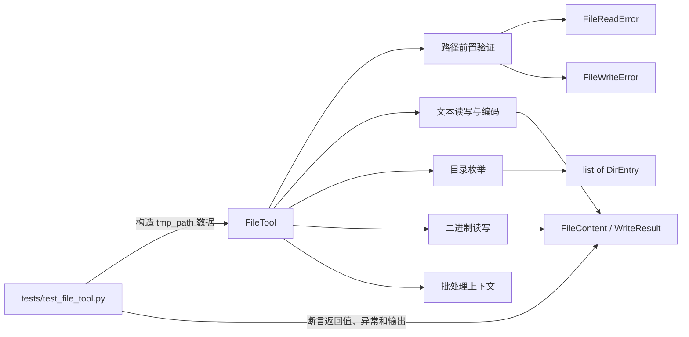

# 实验报告 · Lecture 2：File Tool 文件与系统数据处理

| 项目 | 内容 |
|---|---|
| 实验名称 | Lab02 File Tool：文件与系统数据处理 |
| 课程 | Course Project —— 面向金融的 Python |
| 项目路径 | `/Users/lucius/projects/personal/python-agent-cli` |
| 完成日期 | 2026-09-16 |
| 对应学习目标 | LO1（文件与系统数据处理）、LO7（软件工程与质量保障） |
| 核心产出 | `app/tools/file_tool.py`、`tests/test_file_tool.py`、`app/tools/__init__.py` |
| 最终测试结果 | Python 3.11.16，pytest 9.1.1，**30 passed** |

> **阅读说明**
> 本报告只讨论 Lecture 2 的 File Tool，不复述 Lecture 1 的 Typer/Rich 实验内容。文中的代码、测试名称和终端结果均来自当前项目的实际实现；测试截图由本机 `.venv` 执行 `.venv/bin/pytest -v` 后生成，不是示意图。

---

## 一、实验目标

### 1、实验在总项目中的位置

本课程总项目是一个 AI Coding Agent CLI。Agent 要理解和修改代码，首先必须能够读取文件、写入文件和枚举目录，因此 File Tool 是后续 Search Tool、Tool Registry 和 ReAct Agent 的基础能力：Search Tool 要先找到并读取文件，Tool Registry 要描述工具的参数与返回值，ReAct Agent 则要把工具结果作为新的上下文继续推理。

本实验在 Lecture 1 项目骨架的 `app/tools/` 中实现第一个可复用工具。实现结果不只是两个文件操作函数，还包括结构化返回、自定义异常、编码处理和自动化测试，使调用方能够稳定判断成功与失败。

### 2、具体实验目标

1. 使用 `pathlib.Path` 完成跨平台的路径拼接、检查、目录创建和文件读写。
2. 理解 `with` 语句与上下文管理器协议，保证文件资源在正常或异常路径下都能释放。
3. 区分 `str` 与 `bytes`，理解编码、解码和 `UnicodeDecodeError` 的根因。
4. 使用 `dataclass` 定义 `FileContent`、`WriteResult` 和 `DirEntry`，返回具有明确字段与类型的数据。
5. 建立 `FileToolError → FileReadError / FileWriteError` 异常层级，避免向调用方泄漏零散的底层系统异常。
6. 使用 pytest、`tmp_path`、`pytest.raises` 和 `pytest.mark.parametrize` 验证正常路径、异常路径及边界情况。
7. 实现 `read()`、`write()`、`list_dir()`、`append()`、`read_lines()` 和自动编码检测。
8. 完成挑战任务：实现二进制读写与 `batch()` 上下文管理器。

### 3、学习目标对应关系

| 学习目标 | 本实验中的落实方式 | 验收证据 |
|---|---|---|
| LO1：文件与系统数据处理 | 文本/二进制读写、目录枚举、路径处理、编码检测 | `FileTool` 的 9 个公开方法及结构化结果 |
| LO7：软件工程与质量保障 | 自定义异常、完整类型提示、docstring、pytest 自动化测试 | 30 个用例全部通过，错误被包装为统一异常 |

---

## 二、实验环境与最终成果

### 1、环境信息

| 项目 | 实测结果 |
|---|---|
| 操作系统 | macOS，Apple Silicon |
| Python | 3.11.16 |
| 虚拟环境解释器 | `/Users/lucius/projects/personal/python-agent-cli/.venv/bin/python` |
| pytest | 9.1.1 |
| chardet | 7.6.0 |
| 项目依赖管理 | `requirements.txt` 固定版本 |

Lab02 新增的直接依赖是 `pytest` 和 `chardet`。前者负责测试，后者只在 `encoding=None` 的自动检测分支中使用；`iniconfig`、`packaging`、`pluggy` 等是 pytest 的传递依赖。

```text
$ .venv/bin/python --version
Python 3.11.16

$ .venv/bin/pytest --version
pytest 9.1.1

$ .venv/bin/python -m pip check
No broken requirements found.
```

### 2、项目结构变化

```text
python-agent-cli/
├── app/
│   └── tools/
│       ├── __init__.py          # 统一导出 FileTool 公共 API
│       └── file_tool.py         # 本实验主体，277 行
├── tests/
│   ├── __init__.py
│   └── test_file_tool.py        # 30 个测试项目，269 行
├── docs/
│   ├── image/
│   │   └── report 2 pytest 30 passed.png
│   └── 实验报告lect 2.md
├── .gitignore                   # 新增 .pytest_cache/
└── requirements.txt             # pytest、chardet 及环境依赖
```

### 3、最终功能清单

| 功能 | 方法 | 返回值 | 主要异常 |
|---|---|---|---|
| 读取文本 | `read()` | `FileContent` | `FileReadError` |
| 写入/覆盖文本 | `write()` | `WriteResult` | `FileWriteError` |
| 枚举目录 | `list_dir()` | `list[DirEntry]` | `FileReadError` |
| 追加文本 | `append()` | `WriteResult` | `FileWriteError` |
| 按行读取 | `read_lines()` | `list[str]` | `FileReadError` |
| 自动检测编码 | `read(..., encoding=None)` | `FileContent` | `FileReadError` |
| 读取二进制 | `read_bytes()` | `bytes` | `FileReadError` |
| 写入二进制 | `write_bytes()` | `WriteResult` | `FileWriteError` |
| 批处理上下文 | `batch()` | `Iterator[FileTool]` | 保留块内原异常 |

---

## 三、知识梳理

### 1、`with` 与上下文管理器

`with` 用于管理“进入时获取、退出时释放”的资源。对象进入 `with` 时调用 `__enter__()`，无论代码块正常结束还是抛出异常，离开时都会调用 `__exit__()`，因此比手动 `open()` 后再 `close()` 更安全。

最小示例：

```python
with open("demo.txt", "r", encoding="utf-8") as file:
    content = file.read()
# 到这里文件已经关闭，即使 file.read() 或块内其他代码抛出异常也一样
```

本实验的 `batch()` 使用 `@contextmanager` 实现相同协议。`yield` 之前相当于进入阶段，`finally` 中的代码相当于退出阶段，所以批处理中出现异常时仍会打印“批量结束”。

```python
@contextmanager
def batch(self) -> Iterator[FileTool]:
    print("批量开始")
    try:
        yield self
    finally:
        print("批量结束")
```

### 2、`pathlib`

`pathlib.Path` 把路径从普通字符串变成带方法的对象，可通过 `/` 运算符拼接路径，并用 `exists()`、`is_file()`、`mkdir()`、`read_bytes()` 等方法操作文件系统。相比手工拼接 `/` 或 `\`，它能自动适配不同操作系统，代码也更容易阅读。

最小示例：

```python
from pathlib import Path

target = Path("logs") / "2026" / "run.txt"
target.parent.mkdir(parents=True, exist_ok=True)
target.write_text("ok\n", encoding="utf-8")
```

这里 `parents=True` 会连同缺失的上级目录一起创建，`exist_ok=True` 使重复执行不会因为目录已经存在而失败。本实验的 `write()`、`append()` 和 `write_bytes()` 都采用这一策略。

### 3、字符编码、`str` 与 `bytes`

文件保存的是 `bytes`，Python 中供人阅读和处理的文本是 Unicode `str`。编码是 `str → bytes`，解码是 `bytes → str`；如果实际字节排列与指定编码不一致，解码阶段就会抛出 `UnicodeDecodeError`。

最小示例：

```python
text = "你好"
raw = text.encode("utf-8")       # str -> bytes，共 6 字节
restored = raw.decode("utf-8")   # bytes -> str

assert len(text) == 2
assert len(raw) == 6
assert restored == text
```

本实验默认明确指定 UTF-8；传入 `encoding=None` 时，用 `chardet` 根据字节特征猜测编码。检测结果是概率判断而不是绝对事实，因此空文件会回退到 UTF-8，短文件或特征不足的文件仍可能误判。

### 4、`dataclass`

`dataclass` 根据字段声明自动生成初始化、比较和可读的打印表示，适合表达“有固定字段的一条结果”。相比直接返回字典，它能让 IDE 知道字段名和类型，也能减少字符串键拼错后只能在运行时发现的问题。

最小示例：

```python
from dataclasses import dataclass


@dataclass
class WriteResult:
    path: str
    bytes_written: int
    created: bool


result = WriteResult("out.txt", 7, True)
assert result.bytes_written == 7
```

本实验用 `FileContent` 表示读取结果，用 `WriteResult` 表示写入结果，用 `DirEntry` 表示目录项。调用方无需重新计算编码、字节数或文件类型，可直接使用结构化字段。

### 5、自定义异常与异常链

自定义异常把复杂的底层错误翻译成当前工具领域内的稳定接口。本实验让 `FileReadError` 和 `FileWriteError` 继承 `FileToolError`，调用方既能分别处理读写错误，也能只捕获父类统一重试或记录。

最小示例：

```python
class FileToolError(Exception):
    pass


class FileReadError(FileToolError):
    pass


try:
    Path("missing.txt").read_text(encoding="utf-8")
except OSError as error:
    raise FileReadError(f"读取失败: {error}") from error
```

`raise ... from error` 会保留原始异常链：上层获得稳定的 `FileReadError`，调试时仍能看到最底层的 `OSError` 或 `UnicodeDecodeError`。这兼顾了接口稳定性与排错信息完整性。

### 6、pytest fixture 与 `tmp_path`

fixture 是 pytest 在测试运行前准备并注入的资源。`tmp_path` 为每个测试提供独立的临时 `Path` 目录，测试结束后由 pytest 管理，因此测试可以重复运行，不会修改真实项目文件，也不会因多个用例使用同名文件而互相干扰。

最小示例：

```python
def test_write_text(tmp_path: Path) -> None:
    target = tmp_path / "out.txt"
    FileTool().write(target, "hello")
    assert target.read_text(encoding="utf-8") == "hello"
```

本实验还使用 `pytest.raises` 验证异常类型与错误消息，使用 `@pytest.mark.parametrize` 用同一测试逻辑覆盖空文件、末尾有无换行以及不同换行符等边界输入。

---

## 四、代码说明

### 1、两个代码文件的整体关系

本实验最重要的两个文件分别承担“实现”和“证明”两种职责：

| 文件 | 核心职责 | 不应该承担的职责 |
|---|---|---|
| `app/tools/file_tool.py` | 定义 Tool 的数据结构、异常协议与文件操作 | 不写面向某个具体测试的特殊分支 |
| `tests/test_file_tool.py` | 构造输入、调用公开接口、断言结果与异常 | 不重新实现 FileTool 的业务逻辑 |

两者的关系可以表示为：



一次典型的文本读取调用按以下顺序执行：调用方传入 `str` 或 `Path` → 转换为统一的 `Path` → 验证路径 → 读取原始字节 → 确定编码 → 解码为 `str` → 计算行数 → 组装 `FileContent`。测试文件针对这条链路的每个关键分支分别提供输入和断言。

`file_tool.py` 的物理结构如下，阅读时可以把它分成 7 个区块：

| 行号 | 区块 | 作用 |
|---:|---|---|
| 1–10 | 文档字符串与导入 | 准备类型、上下文管理器、路径和编码检测工具 |
| 13–22 | 异常层级 | 定义统一父异常与读写子异常 |
| 25–52 | 三个 dataclass | 定义读取、写入和目录枚举的结果形状 |
| 55–78 | `FileTool` 与内部校验 | 集中处理文件/目录前置条件 |
| 80–128 | `read()` 与 `_detect_encoding()` | 文本读取、解码、自动检测和结构化返回 |
| 130–236 | 文本写入与目录功能 | `write()`、`list_dir()`、`append()`、`read_lines()` |
| 238–277 | Task 8 | `read_bytes()`、`write_bytes()`、`batch()` |

`FileTool` 当前没有实例属性，多个方法之间通过调用公共辅助逻辑协作，而不是保存可变状态。因此一个实例可以连续执行多次操作；仍采用实例方法，是为了保持 Tool 调用形式统一，也为后续加入工作区根目录、日志器或配置预留空间。

### 2、导入区与类型提示基础

```python
from __future__ import annotations

from collections.abc import Iterator
from contextlib import contextmanager
from dataclasses import dataclass
from pathlib import Path

import chardet
```

| 导入 | 来源 | 用途 |
|---|---|---|
| `annotations` | `__future__` | 延迟求值类型注解，使类体内可以直接写 `Iterator[FileTool]` |
| `Iterator` | 标准库 | 描述 `batch()` 在 `yield` 时产出的对象类型 |
| `contextmanager` | 标准库 | 把包含一个 `yield` 的生成器函数转换成上下文管理器 |
| `dataclass` | 标准库 | 自动生成结果对象的初始化和可读表示 |
| `Path` | 标准库 | 统一处理跨平台路径与文件系统操作 |
| `chardet` | 第三方库 | 在 `encoding=None` 时根据原始字节猜测编码 |

`from __future__ import annotations` 必须位于模块文档字符串之后、普通导入之前。启用后，类型注解会延迟处理，因此 `batch()` 定义在 `FileTool` 类体内时仍可写 `Iterator[FileTool]`，无需给 `FileTool` 加引号。

代码中常见类型写法含义如下：

```python
path: str | Path                 # str 和 Path 二选一
encoding: str | None             # 字符串编码名或 None
list[DirEntry]                   # 元素全部为 DirEntry 的列表
Iterator[FileTool]               # yield 产生 FileTool 的迭代器
def read(...) -> FileContent     # 函数成功时返回 FileContent
```

类型提示不会在运行时自动阻止错误参数，但能作为接口文档，并帮助 IDE、静态检查器和后续 Tool Registry 理解数据形状。

### 3、异常层级与结构化返回

```python
class FileToolError(Exception):
    """FileTool 所有异常的基类。"""


class FileReadError(FileToolError):
    """文件读取失败。"""


class FileWriteError(FileToolError):
    """文件写入失败。"""
```

三个异常构成一棵很小但有意义的继承树。读取方关心具体操作时可分别捕获 `FileReadError` 或 `FileWriteError`；只关心“工具执行失败”时捕获 `FileToolError` 即可，避免把 `OSError`、`LookupError` 等实现细节散落到 Agent 调用代码中。

```python
@dataclass
class FileContent:
    path: str
    content: str
    encoding: str
    size: int
    line_count: int
```

`FileContent` 同时保存路径、内容、实际采用的编码、原始字节长度和行数。特别是 `size` 表示磁盘字节数，不是 Python 字符数，例如“你好”是 2 个字符，但 UTF-8 编码后是 6 个字节。

三个 dataclass 的字段不能互换，它们描述的是三种不同结果：

| 类型 | 字段 | 字段含义 |
|---|---|---|
| `FileContent` | `path` | 实际读取的路径，统一转换为字符串 |
| `FileContent` | `content` | 解码后的 Python `str` |
| `FileContent` | `encoding` | 本次真正用于解码的编码名 |
| `FileContent` | `size` | 文件的原始字节长度，不是字符数 |
| `FileContent` | `line_count` | 按 `splitlines()` 语义计算的逻辑行数 |
| `WriteResult` | `path` | 写入目标路径 |
| `WriteResult` | `bytes_written` | 输入文本按指定编码得到的 payload 字节数，或二进制数据长度 |
| `WriteResult` | `created` | 调用前目标是否不存在 |
| `DirEntry` | `name` | 最后一段文件名或目录名 |
| `DirEntry` | `path` | 从调用路径出发得到的完整子项路径字符串 |
| `DirEntry` | `is_dir` | 子项是否为目录 |
| `DirEntry` | `size` | 文件字节数；目录按接口约定记为 0 |

`@dataclass` 会自动生成类似 `__init__()` 和 `__repr__()` 的方法。因此测试输出或手动打印时可以看到 `WriteResult(path='...', bytes_written=7, created=True)`，比普通元组更容易判断每个值的含义。

### 4、路径前置验证

`_require_file()` 与 `_require_directory()` 把重复的路径校验集中到两个内部方法中。它们不仅判断不存在、文件与目录类型错误，也把路径检查本身可能产生的 `OSError` 包装成 `FileReadError`。

```python
@staticmethod
def _require_file(target: Path) -> None:
    try:
        if not target.exists():
            raise FileReadError(f"文件不存在: {target}")
        if not target.is_file():
            raise FileReadError(f"不是普通文件: {target}")
    except OSError as error:
        raise FileReadError(f"检查文件失败: {error}") from error
```

前置验证的意义是尽早给出可理解的错误。如果把目录直接交给 `read_bytes()`，底层可能只报告 `IsADirectoryError`；经过转换后，调用方会收到更符合 File Tool 语义的“不是普通文件”。

两个方法使用 `@staticmethod`，因为它们的逻辑只依赖传入的 `target`，不读取或修改 `self`。仍把它们放进 `FileTool`，是因为它们属于 File Tool 的内部校验规则；名称以 `_` 开头表示内部实现，外部调用方应使用 `read()`、`list_dir()` 等公开方法。

`try` 内主动抛出的 `FileReadError` 不会被下面的 `except OSError` 捕获，因为 `FileReadError` 并不是 `OSError` 的子类。只有 `exists()`、`is_file()`、`is_dir()` 等系统调用自身失败时，才会进入 `except OSError` 分支并转换异常。

### 5、`read()` 逐段解释

#### i. 方法签名

```python
def read(
    self,
    path: str | Path,
    encoding: str | None = "utf-8",
) -> FileContent:
```

- `path: str | Path` 表示调用方可以传字符串或 `Path`。
- 默认 `encoding="utf-8"`，避免依赖操作系统默认编码。
- `encoding=None` 开启自动检测，这是 Task 7 的扩展。
- 返回类型固定为 `FileContent`，成功路径不会有时返回字符串、有时返回字典。

#### ii. 统一路径并验证

```python
target = Path(path)
self._require_file(target)
```

第一行把两种输入统一转换为 `Path`；第二行确认路径存在且指向普通文件。此后主逻辑不必反复区分字符串和 `Path`，也不必处理目录被误当成文件的情况。

#### iii. 读取原始字节并确定编码

```python
raw_content = target.read_bytes()
actual_encoding = encoding or self._detect_encoding(raw_content)
content = raw_content.decode(actual_encoding)
```

当前实现先读取 `bytes`，再显式解码，而不是直接调用 `read_text()`。这样做是因为自动检测必须看到文件的原始字节，并且 `size=len(raw_content)` 可以直接得到真实文件大小，无需把文本再次编码后估算。

若调用方传入明确编码，`actual_encoding` 就是该编码；若传入 `None`，才调用 `_detect_encoding()`。这种写法保证默认路径仍然确定地使用 UTF-8，不会因启用了 chardet 就让所有读取结果变得不稳定。

#### iv. 异常包装

```python
except (UnicodeDecodeError, LookupError) as error:
    raise FileReadError(
        f"编码解码失败（encoding={actual_encoding}），请检查文件编码: {error}"
    ) from error
except OSError as error:
    raise FileReadError(f"读取失败: {error}") from error
```

`UnicodeDecodeError` 表示字节不符合指定编码，`LookupError` 表示编码名称本身不存在；两者都属于编码问题。`OSError` 则涵盖权限、设备和文件系统 I/O 错误。统一包装后，Agent 不需要了解 Python 文件 API 的全部异常类型，只需处理 `FileReadError`。

#### v. 统计行数并返回

```python
line_count = len(content.splitlines())

return FileContent(
    path=str(target),
    content=content,
    encoding=actual_encoding,
    size=len(raw_content),
    line_count=line_count,
)
```

`splitlines()` 能识别 `\n`、`\r\n` 和 `\r`，空字符串得到空列表，因此空文件行数为 0。与只计算 `"\n"` 的表达式相比，它更清晰，并且对跨平台换行符更健壮；对应的 9 组参数化测试锁定了这些边界行为。

`read()` 的时间复杂度和空间复杂度都与文件大小成正比，因为当前实现会一次把全部文件读入内存。对实验中的代码和小型文本文件足够，但如果将来处理几百 MB 的日志，应增加文件大小上限或流式读取接口。

### 6、`_detect_encoding()` 逐段解释

```python
@staticmethod
def _detect_encoding(data: bytes) -> str:
    if not data:
        return "utf-8"

    try:
        detected = chardet.detect(data).get("encoding")
    except (TypeError, ValueError):
        detected = None
    return detected or "utf-8"
```

执行逻辑分为三步：

1. 空文件没有任何字节特征，直接规定为 UTF-8，保证返回类型始终是 `str`。
2. 非空数据交给 `chardet.detect()`，结果是字典，`encoding` 键可能为编码名，也可能为 `None`。
3. 检测没有结果或输入异常时回退为 UTF-8；真正的 `decode()` 在 `read()` 中完成，解码失败仍会包装为 `FileReadError`。

这里没有使用 chardet 返回的 `confidence` 字段，因此“自动检测成功”只能说明该样本被正确识别，不能推出任意短文本都能准确检测。调用方知道编码时应优先显式传入，例如 `encoding="utf-8"` 或 `encoding="gbk"`。

### 7、`write()` 逐段解释

#### i. 方法签名与覆盖策略

```python
def write(
    self,
    path: str | Path,
    content: str,
    encoding: str = "utf-8",
    overwrite: bool = True,
) -> WriteResult:
```

`overwrite=True` 表示默认允许覆盖，符合普通文本写入的直觉；调用方要保护已有文件时可显式传 `False`。返回 `WriteResult`，使调用方知道本次是新建还是覆盖，以及写入了多少字节。

#### ii. 检查目标状态

```python
target = Path(path)
try:
    target_exists = target.exists()
except OSError as error:
    raise FileWriteError(f"检查目标文件失败: {error}") from error

if target_exists and not overwrite:
    raise FileWriteError(f"文件已存在且不允许覆盖: {target}")

created = not target_exists
```

先保存 `target_exists`，后续的 `created` 与覆盖判断都基于同一时刻的状态。若文件存在且禁止覆盖，代码在任何写操作发生前抛错，因此原内容保持不变；对应测试在捕获异常后再次读取原文件，确认仍是 `original`。

#### iii. 写入前计算字节数并创建目录

```python
try:
    bytes_written = len(content.encode(encoding))
    target.parent.mkdir(parents=True, exist_ok=True)
    target.write_text(content, encoding=encoding, newline="")
except (OSError, UnicodeError, LookupError) as error:
    raise FileWriteError(f"写入失败: {error}") from error
```

字节数在实际修改文件前计算。如果编码名称无效或文本无法用目标编码表示，代码会先失败，不会产生一个由编码失败造成的半成品文件。`mkdir(parents=True, exist_ok=True)` 让 `a/b/c.txt` 在父目录都不存在时也能一次写入。

`newline=""` 明确关闭文本模式的换行转换。若省略该参数，Windows 可能把输入的 `\n` 写成磁盘中的 `\r\n`，此时 `len(content.encode(encoding))` 与实际文件字节数会不同；关闭转换后，对本实验使用的 UTF-8、GBK 等常见无状态编码，`bytes_written` 能跨平台对应写入 payload 的字节数。测试用默认 UTF-8 直接读取原始 bytes 验证这一点；对 `utf-8-sig` 等带 BOM 或其他有状态 codec，不应把该字段扩展解释为所有场景下的物理文件增量。

这里同时捕获三类错误：`OSError` 是文件系统错误，`UnicodeError` 是编码内容错误，`LookupError` 是编码名称错误。审查过程中专门加入 `encoding="not-a-codec"` 的测试，确认底层 `LookupError` 不会直接泄漏。

#### iv. 返回结构化结果

```python
return WriteResult(
    path=str(target),
    bytes_written=bytes_written,
    created=created,
)
```

以 UTF-8 写入 `"你好\n"` 时，两个中文字符各 3 字节，换行 1 字节，所以 `bytes_written == 7`。`created` 在第一次写入时为 `True`，覆盖同一路径时为 `False`，调用方无需再访问文件系统判断。

需要注意：该写入过程并不是“原子写入”。如果进程在 `write_text()` 中途被强制终止，理论上可能留下部分内容；`exists()` 与真正写入之间也存在极短的状态变化窗口。课程当前范围不处理并发与崩溃一致性，生产级实现可采用“临时文件写完后原子替换”的方案。

### 8、`list_dir()` 完整解释

```python
def list_dir(
    self,
    path: str | Path,
    recursive: bool = False,
    pattern: str = "*",
) -> list[DirEntry]:
```

`recursive=False` 只查看直接子项，`recursive=True` 递归进入子目录；`pattern` 使用 glob 语法，例如 `"*.py"` 表示 Python 文件。进入主体前先调用 `_require_directory()`，所以不存在和普通文件路径会得到两种明确错误。

```python
if recursive:
    children = list(target.rglob(pattern))
else:
    children = [
        child for child in target.iterdir() if child.match(pattern)
    ]
```

递归分支由 `rglob()` 自带筛选。非递归分支先用 `iterdir()` 取得直接子项，再通过列表推导式保留匹配项；这样 `pattern` 在两种模式下都有一致含义。`list(...)` 会立即完成枚举，使枚举阶段产生的 `OSError` 落在当前 `try/except` 范围内。

```python
for child in sorted(children, key=lambda item: item.as_posix()):
    is_dir = child.is_dir()
    size = 0 if is_dir else child.stat().st_size
```

`lambda item: item.as_posix()` 是一个匿名函数，用跨平台统一的 `/` 形式作为排序键。稳定排序很重要：若结果顺序依赖文件系统内部顺序，测试和 Agent 上下文会在没有实际内容变化时发生无意义变化。

目录大小没有统一直观含义，`stat().st_size` 在不同文件系统上也不代表“目录内所有文件总大小”，所以接口明确规定目录为 0。任一枚举或元数据读取出现 `OSError` 时，整体操作包装为 `FileReadError`。

### 9、`append()` 与 `read_lines()` 完整解释

```python
def append(
    self,
    path: str | Path,
    content: str,
    encoding: str = "utf-8",
) -> WriteResult:
```

`append()` 的核心模式是 `"a"`：目标不存在时创建，存在时写指针位于末尾，不清空旧内容。它在真正打开文件前计算 `created` 和 `bytes_written`，随后创建父目录，并用上下文管理器保证文件对象关闭。

```python
with target.open("a", encoding=encoding, newline="") as file:
    file.write(content)
```

`newline=""` 与 `write()` 一致，使追加的原始字节在不同平台保持确定。`append()` 不会自动添加换行，调用者想让两段内容分行时必须在 `content` 中显式包含 `\n`。调用者还必须使用与原文件一致的编码，否则同一文件可能混入两种编码的字节，这属于接口使用约束。

```python
def read_lines(...) -> list[str]:
    return self.read(path, encoding=encoding).content.splitlines()
```

`read_lines()` 是“组合已有能力”的例子：它不再自行检查路径或解码，而是调用经过测试的 `read()`，只负责把最终字符串拆成行。`splitlines()` 默认去掉换行分隔符，因此返回 `['first', 'second']`，而不是 `['first\n', 'second\n']`。

### 10、Task 8：二进制读写完整解释

Task 8 在源码中有明确的起止注释。`read_bytes()` 复用普通文件校验，`write_bytes()` 返回与文本写入一致的 `WriteResult`；测试使用 `bytes(range(256))` 覆盖 0–255 的全部字节值，证明往返过程中没有文本编码参与或数据损失。

```python
def read_bytes(self, path: str | Path) -> bytes:
    target = Path(path)
    self._require_file(target)
    try:
        return target.read_bytes()
    except OSError as error:
        raise FileReadError(f"二进制读取失败: {error}") from error
```

二进制读取不接受 `encoding`，因为结果不转换为字符。图片、PDF、压缩包等格式都应按 bytes 处理；若错误地使用文本解码，任意字节序列可能触发 `UnicodeDecodeError` 或被改变。

```python
def write_bytes(self, path: str | Path, data: bytes) -> WriteResult:
    target = Path(path)
    try:
        created = not target.exists()
        target.parent.mkdir(parents=True, exist_ok=True)
        bytes_written = target.write_bytes(data)
    except OSError as error:
        raise FileWriteError(f"二进制写入失败: {error}") from error
```

`Path.write_bytes()` 返回实际写入的字节数，恰好可以直接放入 `WriteResult`。当前方法默认覆盖已有文件，没有提供 `overwrite=False`；这是 Task 8 的既定范围，也是总结中明确记录的后续扩展点。

### 11、Task 8：`batch()` 上下文管理器完整解释

`batch()` 将 `yield self` 放在 `try/finally` 中，因此既支持 `with tool.batch() as active_tool:`，也能确保块内异常发生后仍执行结束逻辑。测试故意抛出 `RuntimeError("模拟失败")`，最终仍捕获到“批量开始”和“批量结束”两行输出。

`@contextmanager` 会把这个生成器函数包装成一个实现 `__enter__()` / `__exit__()` 协议的对象。进入 `with` 时执行到 `yield self` 并把 `self` 绑定给 `as` 后面的变量；退出时从 `yield` 后继续执行，`finally` 保证结束消息一定出现。

当前 `batch()` 只是批处理边界和资源管理协议的教学示例：它不会缓存操作，不提供数据库式事务，也不会在中途失败时撤销已经写入的文件。报告若把它描述成“原子批量写入”或“失败自动回滚”都是错误的。

### 12、`app/tools/__init__.py` 的作用

```python
from app.tools.file_tool import (
    DirEntry,
    FileContent,
    FileReadError,
    FileTool,
    FileToolError,
    FileWriteError,
    WriteResult,
)

__all__ = [
    "DirEntry",
    "FileContent",
    "FileReadError",
    "FileTool",
    "FileToolError",
    "FileWriteError",
    "WriteResult",
]
```

这一文件建立包级公共 API。外部代码既可写 `from app.tools.file_tool import FileTool`，也可写更简洁的 `from app.tools import FileTool`；`__all__` 明确哪些名称属于稳定公开接口，内部辅助方法不会被误认为公共能力。

---

## 五、测试代码完整导读

### 1、测试文件的整体框架

`tests/test_file_tool.py` 的目的不是演示功能，而是建立可重复执行的行为契约。每个测试大致遵循 Arrange–Act–Assert 三段结构：

1. **Arrange（准备）**：在 `tmp_path` 中创建文件、目录或原始字节。
2. **Act（执行）**：调用 `FileTool` 的某个公开方法。
3. **Assert（断言）**：检查返回字段、磁盘内容、异常类型或标准输出。

例如：

```python
def test_write_overwrites_existing_file(tmp_path: Path) -> None:
    # Arrange：准备已有文件
    path = tmp_path / "existing.txt"
    path.write_text("old content", encoding="utf-8")

    # Act：调用被测方法
    result = FileTool().write(path, "new")

    # Assert：同时检查返回值和真实文件内容
    assert result.created is False
    assert result.bytes_written == 3
    assert path.read_text(encoding="utf-8") == "new"
```

测试直接操作临时文件系统，没有把 `Path` 或 `chardet` 全部 mock 掉。这样覆盖的是 File Tool 与真实 Python 文件 API 的集成行为，同时又不会污染项目目录。

测试文件也可以按功能分块阅读：

| 行号 | 测试区块 | 测试函数数 / pytest items |
|---:|---|---:|
| 10–42 | 文本读取与解码异常 | 4 / 4 |
| 45–89 | 文本写入、覆盖与父目录 | 4 / 4 |
| 92–111 | 行数参数化 | 1 / 9 |
| 114–162 | 目录枚举 | 5 / 5 |
| 165–208 | 追加、按行读取、编码检测、无效编码 | 4 / 4 |
| 214–269 | Task 8 二进制与 batch | 4 / 4 |
| **合计** |  | **22 / 30** |

### 2、导入区与 pytest 自动注入

```python
from pathlib import Path

import pytest

from app.tools.file_tool import FileReadError, FileTool, FileWriteError
```

- `Path` 用于给 fixture 参数加类型提示，也用于构造临时路径。
- `pytest` 提供 fixture、异常断言、参数化和输出捕获类型。
- 测试只导入外部需要观察的类：被测主体 `FileTool` 与两种具体异常。

函数参数 `tmp_path: Path` 中，`tmp_path` 的名字决定 pytest 注入哪个 fixture，`: Path` 只是类型提示。pytest 在调用测试函数前创建独立临时目录，再把它作为 `Path` 对象传入；开发者不需要手工调用 fixture。

### 3、四种核心 pytest 技术

#### i. 普通 `assert`

pytest 使用 Python 原生 `assert`，但失败时会重写断言并显示左右值差异。例如：

```python
assert result.bytes_written == 7
assert result.created is True
```

第一行检查数值相等，第二行用 `is True` 明确检查布尔语义。只检查方法“没有抛异常”是不够的，还要检查返回对象中的每个关键字段。

#### ii. `pytest.raises`

```python
with pytest.raises(FileReadError, match="文件不存在"):
    FileTool().read(tmp_path / "missing.txt")
```

若块内没有抛异常，测试失败；若抛出其他异常类型，测试也失败。`match` 使用正则表达式匹配错误消息，这能同时验证“异常分类正确”和“错误信息对调用者有意义”。

#### iii. `pytest.mark.parametrize`

```python
@pytest.mark.parametrize(
    "text, expected",
    [
        ("", 0),
        ("single line", 1),
        ("a\r\nb\r\n", 2),
    ],
)
```

pytest 会用每组数据分别调用同一个测试函数。当前源文件有 22 个测试函数，但参数化的 `test_line_count` 展开为 9 项，所以最终收集到 30 个 test items。

#### iv. `capsys`

```python
def test_batch_prints_boundaries_and_yields_tool(
    capsys: pytest.CaptureFixture[str],
) -> None:
    ...
    assert capsys.readouterr().out.splitlines() == ["批量开始", "批量结束"]
```

`capsys` 临时捕获 `sys.stdout` 和 `sys.stderr`。`readouterr()` 返回到当前时刻捕获的输出并清空缓冲，`.out` 是标准输出字符串，`splitlines()` 让断言不依赖末尾换行符。

### 4、文本读取测试逐项解释

| 测试函数 | 准备数据 | 执行动作 | 核心断言 |
|---|---|---|---|
| `test_read_text_file` | UTF-8 的 `hello\nworld\n` | `read(path)` | 路径、内容、编码、12 字节、2 行全部正确 |
| `test_read_nonexistent_raises` | 不创建目标 | 读取缺失路径 | 抛 `FileReadError`，消息含“文件不存在” |
| `test_read_directory_raises` | 直接传 `tmp_path` 目录 | 对目录调用 `read()` | 抛 `FileReadError`，消息含“不是普通文件” |
| `test_read_decode_error_is_wrapped` | 写入 `b"\xff\xfe"` | 指定 UTF-8 解码 | 底层解码错误被包装为 `FileReadError` |

`test_read_text_file` 为什么断言 `size == 12`：`hello` 5 字节、换行 1 字节、`world` 5 字节、末尾换行 1 字节，总计 12。由于全部是 ASCII 字符，字符数恰好等于 UTF-8 字节数；中文测试则专门验证两者不相等的情况。

`b"\xff\xfe"` 不是合法的 UTF-8 开头。这个测试没有只写一个“看起来乱码”的字符串，而是直接写原始 bytes，确保能够稳定触发真实 `UnicodeDecodeError`。

### 5、文本写入测试逐项解释

#### i. 中文往返与原始字节

```python
result = tool.write(path, "你好\n")

assert result.path == str(path)
assert result.bytes_written == 7
assert result.created is True
assert tool.read(path).content == "你好\n"
assert path.read_bytes() == "你好\n".encode("utf-8")
```

这组断言从三个层面验证同一次写入：

1. **元数据层**：`WriteResult` 路径、字节数和创建标志正确。
2. **功能层**：用 File Tool 读回后，文本内容与输入完全一致。
3. **存储层**：直接读取原始字节，确认没有发生平台换行转换或编码变化。

“你好”的 UTF-8 是 6 字节，再加 `\n` 的 1 字节，共 7 字节。最后一条断言与源码中的 `newline=""` 共同保证该结论在 Windows 上也成立。

#### ii. 默认覆盖

`test_write_overwrites_existing_file` 先写入 `old content`，再调用默认 `overwrite=True` 的 `write()`。它断言 `created is False`、新内容是 `new`，证明“存在时覆盖”与“新建标志”是两个独立但一致的行为。

#### iii. 禁止覆盖

`test_write_no_overwrite_raises` 不仅用 `pytest.raises` 检查 `FileWriteError`，还在异常后重新读取文件并断言仍为 `original`。这证明保护逻辑发生在写入前，而不是“覆盖后再报错”。

#### iv. 自动创建父目录

`test_write_creates_parent_dirs` 直接把目标设为 `a/b/c.txt`，事先不创建 `a` 和 `b`。成功写入证明 `mkdir(parents=True, exist_ok=True)` 的两个关键参数都生效。

#### v. 无效编码名

`test_write_wraps_unknown_encoding` 传入不存在的 `not-a-codec`。测试期待 `FileWriteError`，用于防止底层 codec 查找产生的 `LookupError` 穿透 Tool 的公共异常边界。

### 6、行数参数化测试完整解释

| 输入文本 | 预期 | 验证点 |
|---|---:|---|
| `""` | 0 | 空文件不虚构出一行 |
| `"single line"` | 1 | 无末尾换行的单行 |
| `"single line\n"` | 1 | 末尾换行不是额外空行 |
| `"a\nb\nc"` | 3 | 多行，无末尾换行 |
| `"a\nb\nc\n"` | 3 | 多行，有末尾换行 |
| `"\n"` | 1 | 只有一个换行符表示一个空行 |
| `"a\n\n"` | 2 | 内容行加一个空白行 |
| `"a\rb"` | 2 | 单独 `\r` 也被识别 |
| `"a\r\nb\r\n"` | 2 | Windows CRLF 被作为一个分隔符，而不是两个 |

测试通过 `path.write_text(...)` 准备输入，再调用 `FileTool().read(path).line_count`。它验证的是公开结果，而没有在测试中复制 `splitlines()` 算法；否则测试与实现犯同一个错误时也可能一起通过。

### 7、目录枚举测试逐项解释

| 测试函数 | 被验证的行为 |
|---|---|
| `test_list_dir_returns_sorted_entries` | 文件与目录都会返回；按名称稳定排序；目录大小为 0；中文文件是 6 字节 |
| `test_list_dir_recursive_pattern` | `recursive=True, pattern="*.py"` 能找到嵌套 Python 文件并排除 `.txt` |
| `test_list_dir_non_recursive_pattern` | 非递归模式也遵守 pattern，避免参数只在一个分支生效 |
| `test_list_dir_rejects_file` | 普通文件不能作为待枚举目录 |
| `test_list_dir_rejects_missing_directory` | 缺失目录得到明确的 `FileReadError` |

第一项故意先创建 `z.txt`、后创建目录 `a`，但期望返回顺序仍为 `a`、`z.txt`。这排除了“恰好按创建顺序返回”的偶然通过，真正验证了 `sorted()`。

`"中文"` 由两个汉字组成，UTF-8 下每个 3 字节，所以 `DirEntry.size == 6`。该断言再次区分“字符个数”和“磁盘字节数”。

### 8、追加、按行读取与编码检测测试

#### i. 连续追加

`test_append_twice_and_read_lines` 的第一次追加写入 `first\n`，第二次追加 `second\r\nthird`。它同时验证：第一次 `created=True`、第二次 `created=False`、旧内容未被清空、`read_lines()` 能统一处理 LF 与 CRLF，以及原始磁盘 bytes 没有被平台自动转换。

#### ii. GBK 自动检测

```python
expected = "这是一个用于测试编码检测的中文文件。"
path.write_bytes(expected.encode("gbk"))
result = FileTool().read(path, encoding=None)
```

测试先明确用 GBK 编码生成原始字节，再让 File Tool 自动检测，而不是直接创建普通 UTF-8 文本。断言允许 `gbk`、`gb2312`、`gb18030` 三种名称，是因为这些中文编码兼容范围重叠，chardet 对该样本可能使用其中任一标签；真正必须相等的是解码后的 `content` 和原始字节长度。

#### iii. 空文件回退

空文件无法提供统计特征，`chardet` 没有依据判断编码。`test_read_empty_file_with_auto_encoding` 明确要求 `content == ""` 且 `encoding == "utf-8"`，把回退策略固定为可预测行为。

### 9、Task 8 测试逐项解释

#### i. 二进制往返

`bytes(range(256))` 包含从 `0x00` 到 `0xff` 的每个单字节值，其中许多值不是合法 UTF-8。写入后逐字节读回相同数据，证明方法没有经过文本编码层；随后再次写入 `b"replacement"`，验证覆盖时 `created=False` 和字节数更新正确。

#### ii. 二进制错误路径

`test_read_bytes_rejects_invalid_paths` 在一个函数里验证缺失路径和目录路径，因为二者都属于同一公开方法的前置条件，但预期消息不同。它确保 `read_bytes()` 与文本 `read()` 共享一致的文件校验语义。

#### iii. 正常退出的上下文管理器

测试使用 `with tool.batch() as active_tool:`，断言 `yield` 出来的对象就是原始 `tool`，随后通过 `capsys` 检查输出顺序。若实现误写成 `yield None`，输出测试可能仍通过，但身份断言会失败。

#### iv. 异常退出的上下文管理器

第二个 batch 测试在 `with` 块内主动抛出 `RuntimeError("模拟失败")`。外层 `pytest.raises` 证明异常没有被上下文管理器吞掉，输出断言则证明 `finally` 已执行；两个断言合起来验证“清理发生，但原异常继续传播”。

### 10、22 个测试函数索引

| # | 测试函数 | 一句话说明 |
|---:|---|---|
| 1 | `test_read_text_file` | 检查正常 UTF-8 读取的全部 `FileContent` 字段 |
| 2 | `test_read_nonexistent_raises` | 检查缺失文件异常 |
| 3 | `test_read_directory_raises` | 检查目录不能作为文本文件读取 |
| 4 | `test_read_decode_error_is_wrapped` | 检查非法 UTF-8 的异常包装 |
| 5 | `test_write_then_read_roundtrip` | 检查中文写读往返、字节数和原始落盘 bytes |
| 6 | `test_write_overwrites_existing_file` | 检查默认覆盖与 `created=False` |
| 7 | `test_write_no_overwrite_raises` | 检查禁止覆盖且旧数据不变 |
| 8 | `test_write_creates_parent_dirs` | 检查递归创建父目录 |
| 9 | `test_line_count` | 用 9 组输入检查行数边界 |
| 10 | `test_list_dir_returns_sorted_entries` | 检查稳定排序和 `DirEntry` 元数据 |
| 11 | `test_list_dir_recursive_pattern` | 检查递归 glob 筛选 |
| 12 | `test_list_dir_non_recursive_pattern` | 检查非递归模式同样遵守 pattern |
| 13 | `test_list_dir_rejects_file` | 检查普通文件不能被枚举 |
| 14 | `test_list_dir_rejects_missing_directory` | 检查缺失目录异常 |
| 15 | `test_append_twice_and_read_lines` | 检查连续追加、行拆分和原始 bytes |
| 16 | `test_read_detects_gbk_encoding` | 检查 GBK 自动检测与中文恢复 |
| 17 | `test_read_empty_file_with_auto_encoding` | 检查空文件回退 UTF-8 |
| 18 | `test_write_wraps_unknown_encoding` | 检查无效编码名称的异常包装 |
| 19 | `test_binary_roundtrip` | 检查 0–255 全字节往返和二次覆盖 |
| 20 | `test_read_bytes_rejects_invalid_paths` | 检查二进制读取的两种非法路径 |
| 21 | `test_batch_prints_boundaries_and_yields_tool` | 检查正常 batch 输出和 `yield self` |
| 22 | `test_batch_prints_end_when_operation_fails` | 检查异常时 finally 执行且原异常传播 |

### 11、需求与测试的双向映射

| 实验要求 | 实现位置 | 主要测试 |
|---|---|---|
| `read()` 返回 `FileContent` | `FileTool.read` | `test_read_text_file`、读取异常组 |
| `write()` 返回 `WriteResult` | `FileTool.write` | 中文往返、覆盖、禁止覆盖、父目录 |
| 自定义异常 | 三层异常类与包装分支 | decode error、missing、not directory、unknown encoding |
| `tmp_path` 与 `pytest.raises` | 测试函数参数和异常块 | 全部文件测试、全部异常测试 |
| 参数化行数 | `splitlines()` | `test_line_count` 的 9 个 items |
| `list_dir()` | `iterdir` / `rglob` / `DirEntry` | 5 个目录测试 |
| 追加与按行读取 | `append` / `read_lines` | `test_append_twice_and_read_lines` |
| 自动编码检测 | `_detect_encoding` | GBK 与空文件测试 |
| 二进制读写 | `read_bytes` / `write_bytes` | 二进制往返、错误路径 |
| 上下文管理器 | `batch` | 正常退出、异常退出 |

### 12、当前测试明确没有覆盖的范围

为了正确理解“30 passed”的含义，也必须说明它不代表所有可能情况都已证明：

1. 没有在 Windows 机器上实际运行，但通过 `newline=""` 和原始字节断言消除了主要换行差异；最终跨平台结论仍应由 CI 或 Windows 实机确认。
2. 没有模拟权限拒绝、磁盘写满、文件在操作中被删除等操作系统故障；源码已统一捕获 `OSError`，但每个具体系统错误未逐项注入。
3. 没有测试符号链接循环、并发写入和 `exists()` 后状态变化，这些属于后续安全隔离与并发控制范围。
4. 自动编码检测只验证 GBK 和空文件，没有穷举 Big5、Shift-JIS 等编码；chardet 本身是启发式工具。
5. 没有大文件性能测试；当前 `read()` 会把整个文件加载进内存。

这些是已知边界，不是当前实验必做项遗漏。明确边界可以避免把单元测试结果夸大成未经验证的保证。

---

## 六、AI 协作过程

本实验按“原始 Prompt → 生成代码 → 审查 → 修改 → 验证”的闭环完成。以下记录 4 轮关键迭代，其中前两轮对应实验给出的 Prompt 1、Prompt 2，后两轮体现扩展任务和代码审查。

### 1、轮次 1：生成 FileTool 文本读写骨架

#### i. 原始 Prompt

```text
你是一名资深 Python 工程师。请在 app/tools/file_tool.py 中实现一个 FileTool 类，
用于 AI Coding Agent CLI 的文件读写。

要求：
1. 用 pathlib.Path 处理路径，跨平台；
2. read(path, encoding="utf-8") 返回 dataclass FileContent；
3. write(...) 返回 dataclass WriteResult；
4. 定义 FileToolError / FileReadError / FileWriteError；
5. 文件开头加 from __future__ import annotations；
6. 完整类型提示 + docstring，符合 PEP8。
```

#### ii. AI 生成代码

第一版实现建立了异常层级、两个 dataclass，以及 `read()`、`write()` 的基本流程，能够完成 UTF-8 文本往返和自动创建父目录。

```python
size = len(content.encode(encoding))
line_count = content.count("\n")
if content and not content.endswith("\n"):
    line_count += 1
```

#### iii. 审查意见

| 编号 | 检查点 | 结论 |
|---|---|---|
| R1-1 | 是否使用 `Path` 而不是字符串拼路径 | 通过 |
| R1-2 | 是否区分文件不存在与路径是目录 | 通过 |
| R1-3 | 解码失败是否包装为 `FileReadError` | 通过 |
| R1-4 | 行数表达式是否容易理解、是否兼容 `\r` | 可改进 |
| R1-5 | 无效编码名是否会泄漏 `LookupError` | 后续审查发现需修复 |

#### iv. 修改后的代码

最终行数统计改为：

```python
line_count = len(content.splitlines())
```

该写法同时覆盖空文件、末尾有无换行、Unix、Windows 和旧式 Mac 换行符。编码异常范围也扩展到 `LookupError`，保证 File Tool 的异常接口一致。

### 2、轮次 2：使用 Prompt 2 编写 pytest 测试

#### i. 原始 Prompt

```text
请用 pytest 为 FileTool 编写单元测试到 tests/test_file_tool.py。
要求：
1. 用 tmp_path fixture，不污染真实文件系统；
2. 覆盖正常读写、文件不存在、对目录读取、overwrite=False、
   自动创建父目录、写后读往返一致；
3. 用 pytest.raises 测试异常；
4. 用 @pytest.mark.parametrize 测试行数统计。
```

#### ii. AI 生成代码

第一轮测试覆盖了文本读写主体和 7 组行数边界，运行结果为 `14 passed`。所有真实文件都位于 `tmp_path`，没有在项目目录生成测试数据。

#### iii. 审查意见

正常路径已经覆盖，但仅验证“成功读写”不足以证明异常接口正确。后续补充了非法 UTF-8、无效编码名、缺失目录、二进制错误路径，以及上下文管理器异常退出等测试。

#### iv. 修改后的测试策略

```python
with pytest.raises(FileReadError, match="编码解码失败"):
    FileTool().read(path, encoding="utf-8")

with pytest.raises(FileWriteError, match="写入失败"):
    FileTool().write(path, "text", encoding="not-a-codec")
```

测试不仅断言“会报错”，还验证异常类型和关键消息，使底层异常意外泄漏时能够立即失败。

### 3、轮次 3：扩展目录、追加与编码检测

#### i. 原始 Prompt

```text
完成 step10-12（主要自己做，别直接照搬照抄要求中的参考代码）
```

#### ii. 初始设计

实现没有直接照抄参考片段，而是做了三项一致性设计：

1. `list_dir()` 在递归和非递归模式下都遵守 `pattern`；
2. `append()` 与 `write()` 一样自动创建父目录；
3. `read(encoding=None)` 返回实际采用的编码，`size` 直接记录原始字节数。

#### iii. 审查意见

参考实现中非递归分支直接使用 `iterdir()`，参数 `pattern` 实际只在递归时生效，这会让同一个参数在两种模式下含义不同。最终实现使用 `child.match(pattern)` 补齐非递归筛选，并增加专门测试锁定这一行为。

#### iv. 验证结果

GBK 中文文件能被自动检测并恢复；空文件无法提供编码特征时回退到 UTF-8；连续追加两次后内容顺序正确，`read_lines()` 返回不含换行符的列表。该轮完成后测试数从 14 增至 21。

### 4、轮次 4：Task 8 与全项目代码审查

#### i. 原始 Prompt

```text
完成step13，并把这一部分的实现代码标记出来；之后对于整个filetool和
testfiletool还有整个项目到现在的进度部分，进行一次debug和代码审查。
```

#### ii. AI 生成代码

Task 8 新增 `read_bytes()`、`write_bytes()` 和 `batch()`，并用显眼注释标记实现与测试的起止位置。`batch()` 使用 `try/finally`，让异常路径与正常路径都能执行清理阶段。

#### iii. 审查发现的问题

| 编号 | 问题 | 风险 | 修复 |
|---|---|---|---|
| R4-1 | `write()` 没有包装无效编码名产生的 `LookupError` | 调用方收到不一致的底层异常 | 写入前编码并捕获 `LookupError` |
| R4-2 | 行数只统计 `\n` | 单独 `\r` 的文件统计错误 | 改用 `splitlines()` |
| R4-3 | `exists()` / `is_file()` 位于异常包装之外 | 特殊权限错误可能泄漏 `OSError` | 增加 `_require_file()` / `_require_directory()` |
| R4-4 | `app/tools/__init__.py` 为空 | 公共 API 不集中 | 显式导出 7 个公共类型 |
| R4-5 | `.pytest_cache/` 未忽略 | 测试缓存可能进入 Git 状态 | 加入 `.gitignore` |
| R4-6 | 文本模式可能在 Windows 转换换行符 | `bytes_written` 与 UTF-8 落盘 bytes 可能不一致 | 写入时使用 `newline=""`，测试直接断言原始 bytes |

#### iv. 修改后验证

最终测试数达到 30。除 pytest 外，还执行了 `compileall`、`pip check`、`git diff --check`、CLI 回归、`app.tools` 公共导入和脚手架幂等验证，均通过。

---

## 七、测试结果

### 1、执行命令与总结果

```bash
cd /Users/lucius/projects/personal/python-agent-cli
source .venv/bin/activate
pytest -v
```

📷 **图 1：本机真实 `pytest -v` 输出（30 项全部通过）**


```text
collected 30 items
...
============================== 30 passed in 0.11s ==============================
```

截图中的 30 个项目来自 22 个测试函数，其中 `test_line_count` 通过参数化展开为 9 个独立测试项目。因此“函数数”和 pytest 显示的“items 数”不同，这是参数化的正常结果。

### 2、测试覆盖说明

| 测试组 | pytest 项目数 | 主要验证内容 |
|---|---:|---|
| 文本读取 | 4 | 正常读取、不存在、目录、非法 UTF-8 |
| 文本写入 | 5 | 中文往返、覆盖、新建、禁止覆盖、无效编码 |
| 行数统计 | 9 | 空文件、末尾换行、空白行、`\n`、`\r`、`\r\n` |
| 目录枚举 | 5 | 排序、大小、递归、两种 pattern、错误路径 |
| 追加与按行读取 | 1 | 两次追加、自动建目录、去除换行符 |
| 自动编码检测 | 2 | GBK 中文、空文件回退 UTF-8 |
| 二进制读写 | 2 | 0–255 全字节往返、覆盖、错误路径 |
| 批处理上下文 | 2 | 正常退出、异常退出仍执行 finally |
| **合计** | **30** | 全部通过 |

### 3、关键用例为何必要

1. `test_write_no_overwrite_raises` 在捕获异常后重新读取原文件，验证“不覆盖”不只是抛错，而且确实没有修改数据。
2. `test_read_decode_error_is_wrapped` 用 `b"\xff\xfe"` 构造非法 UTF-8，验证解码错误被翻译成 `FileReadError`。
3. `test_line_count` 同时测试三种换行符，直接验证审查中对行数算法的修改。
4. `test_read_detects_gbk_encoding` 写入真实 GBK 字节，而不是伪造 chardet 返回值，因此同时覆盖字节读取、检测与解码。
5. `test_binary_roundtrip` 使用 `bytes(range(256))`，包含所有单字节值，能发现任何错误的文本编码或字节变换。
6. `test_batch_prints_end_when_operation_fails` 故意在 `with` 块中抛异常，验证 `finally` 的清理承诺，而不只测试正常路径。

### 4、额外质量检查

```text
$ .venv/bin/python -m compileall -q app tests main.py init_project.py
# 无输出，退出码 0

$ .venv/bin/python -m pip check
No broken requirements found.

$ git diff --check
# 无输出，说明没有尾随空格等 diff 格式问题

$ .venv/bin/python main.py version
AI Coding Agent CLI v0.1
```

这些检查说明 Lab02 的变更没有破坏 Lecture 1 的 CLI，Python 文件能够编译，依赖关系完整，代码差异没有明显格式错误。

---

## 八、思考题回答

### 1、为什么 `with open(...) as file:` 比手动 `open()` + `close()` 安全？

上下文管理器进入时执行 `__enter__()`，退出时执行 `__exit__(exc_type, exc_value, traceback)`。解释器保证离开 `with` 块时调用 `__exit__()`，所以无论块内正常返回、主动 `raise`，还是发生其他异常，文件都会关闭。

手动关闭的风险如下：

```python
file = open("result.txt", "w", encoding="utf-8")
file.write("第一部分")
raise RuntimeError("处理中断")
file.close()  # 永远执行不到
```

此时文件描述符可能在一段时间内保持打开，缓冲区也可能没有按预期刷新。改用 `with` 后，异常会继续传播，但资源释放不会被跳过；这就是“业务失败”与“资源清理”分离。

### 2、`Path.read_text()` 已经封装 `with`，为什么还要学习 `contextlib.contextmanager`？

`Path.read_text()` 只解决一次文件打开和关闭，而上下文管理器是一种更普遍的生命周期抽象。它能管理临时目录、数据库事务、网络连接、锁、日志范围和多步批处理，资源不一定是文件。

在后续 Command Tool 中，可在进入时建立隔离工作目录、退出时恢复当前目录或清理临时资源；在 LLM Client 中，可在进入时建立会话、退出时关闭连接或记录请求统计。本实验的 `batch()` 用“批量开始/结束”演示了这一结构，虽然它当前只打印边界，但协议与真实资源管理相同。

### 3、解释 `bytes`、`str`、编码三者关系，以及 `errors="replace"` 的性质

`bytes` 是磁盘或网络中的原始数值序列，`str` 是 Python 中的 Unicode 文本。编码规定如何把字符映射为字节，解码则按同一规则把字节还原为字符；如果写入使用 UTF-8、读取却使用 GBK，解码器会按错误规则分组和解释字节，可能报错，也可能得到乱码。

`errors="replace"` 会把无法解码的部分替换成 `�`，它让程序继续运行，但丢失的原始字符无法从替换结果恢复。因此它是容错策略，不是修复编码问题；如果业务要求内容准确，它只是在掩盖“编码未知或指定错误”的根因。正确处理仍应确认真实编码，或保留原始 `bytes` 后再尝试可靠检测。

### 4、为什么返回 `FileContent`，而不是直接返回字符串？

字符串只能携带内容，调用方还要自己保存路径、编码、大小和行数；不同调用方可能重复计算并得到不一致结果。`FileContent` 把一次读取的上下文固化成固定结构，类型提示还能帮助 IDE 和静态检查器发现字段使用错误。

对 Lab05 Tool Registry 而言，固定字段和类型可以自然映射到 JSON Schema 或序列化结构，使 Registry 知道工具输出有哪些字段。对 Lab07 ReAct Agent 而言，模型拿到的不只是大段文本，还能知道来源路径、编码和规模，从而在上下文预算、错误解释和后续行动中作出更可靠的决定。

### 5、调用方想对所有 FileTool 错误统一重试，应捕获哪个类？

应捕获父类 `FileToolError`：

```python
try:
    result = tool.read("config.txt")
except FileToolError:
    # 统一记录或重试一次
    ...
```

因为 `FileReadError` 和 `FileWriteError` 都继承它，捕获父类可以覆盖当前全部工具错误；需要分别处理时再捕获子类。这体现了“按抽象层级处理异常”的原则：底层提供具体分类，上层按自己的决策粒度选择父类或子类，不必枚举每一种系统异常。

### 6、`tmp_path` 如何实现可重复、不污染、可并行？

pytest 在每个测试调用时创建独立临时目录，并把对应 `Path` 作为参数注入。用例只在自己的目录中读写，同名文件不会与其他用例冲突；测试结束后临时资源由 pytest 管理，所以连续运行不会受到上一次残留状态影响。

如果直接使用 `./test_data/`，可能发生以下问题：旧文件让 `created` 断言随机失败；两个并行用例同时修改同一文件；失败用例留下垃圾；测试意外覆盖人工准备的数据；不同启动目录导致相对路径指向不同位置。`tmp_path` 把这些环境因素隔离掉，使失败更可能来自被测代码本身。

### 7、如何改写 `line_count`，并验证边界情况？

参考表达式通过计算 `\n` 并判断末尾是否换行得到行数，逻辑正确但分支较难一眼确认，而且不会把单独的 `\r` 当作换行。当前实现改为：

```python
line_count = len(content.splitlines())
```

验证使用参数化输入：

```python
@pytest.mark.parametrize(
    "text, expected",
    [
        ("", 0),
        ("single line", 1),
        ("single line\n", 1),
        ("a\nb\nc", 3),
        ("a\nb\nc\n", 3),
        ("\n", 1),
        ("a\n\n", 2),
        ("a\rb", 2),
        ("a\r\nb\r\n", 2),
    ],
)
def test_line_count(tmp_path: Path, text: str, expected: int) -> None:
    path = tmp_path / "lines.txt"
    path.write_text(text, encoding="utf-8")
    assert FileTool().read(path).line_count == expected
```

这 9 组数据覆盖空文件、单行、多行、末尾有无换行、连续换行以及三种常见换行格式。每组在 pytest 输出中都是独立项目，某个边界回归时可以立即看到具体输入。

---

## 九、总结

### 1、遇到的问题与解决过程

#### i. 依赖范围变化

开始只完成 Step 4–6 时，File Tool 仅使用标准库，因此环境中不需要 pytest 与 chardet。进入 Step 7–12 后，测试和自动编码检测成为实际功能，重新安装这两个直接依赖，并按实验要求用 `pip freeze` 更新 `requirements.txt`；最终 `pip check` 无损坏依赖。

#### ii. 编码错误需要稳定的异常边界

初版只处理 `UnicodeDecodeError` 和常见 `OSError`。代码审查发现，无效编码名会产生 `LookupError`，如果不包装，调用方必须额外了解 Python codec 查找机制。最终把解码、编码名称和系统错误分别转换为 `FileReadError` 或 `FileWriteError`，并补测试防止回归。

#### iii. 行数统计的可读性与跨平台边界

手工计算 `\n` 数量能覆盖实验最初的示例，却不自然支持单独 `\r`。改用 `splitlines()` 后实现更短，语义更直接，并通过 9 组参数化输入验证，不再依赖人工推导复杂表达式。

#### iv. 异常路径必须主动测试

正常执行 `with tool.batch()` 只能证明开始和结束会打印，不能证明发生异常时仍能清理。测试中主动抛出 `RuntimeError` 后，`finally` 仍打印“批量结束”，这才验证了上下文管理器最重要的承诺。

#### v. `bytes_written` 的跨平台语义

macOS/Linux 文本写入通常会原样保留 `\n`，但 Windows 文本模式可能转换成 `\r\n`。代码审查后在 `write_text()` 和追加文件的 `open()` 中加入 `newline=""`，并在测试中直接检查原始 bytes；这样本实验默认 UTF-8 路径的字节数解释不依赖操作系统。

### 2、技术收获

1. 掌握了从 `Path` 构造、路径验证、自动建目录到文本和二进制读写的完整流程。
2. 理解了 `str` 与 `bytes` 的边界，并能用实际字节长度解释中文 UTF-8 大小。
3. 能使用 dataclass 设计稳定的 Tool 返回协议，而不是只让函数“打印一些东西”。
4. 能设计父子异常层级，并用 `raise ... from ...` 同时保留领域语义和底层原因。
5. 能用 `tmp_path`、`pytest.raises`、参数化和 `capsys` 分别测试文件系统、异常、边界数据和标准输出。
6. 理解了 `@contextmanager` 中 `yield` 与 `finally` 的角色，并能验证异常路径。

### 3、方法论收获

本实验最明显的变化是：验收标准从“命令能运行”提升为“接口在正常、异常和边界输入下都稳定”。例如写入成功并不能证明覆盖保护正确，正常读取 UTF-8 也不能证明编码错误被正确包装，正常离开 `with` 更不能证明异常时会清理。每发现一个真实边界，就把它转化为自动化测试，才能让后续重构有可靠的安全网。

AI 在本实验中加快了骨架和测试的生成，但最终质量来自逐条核对需求、检查异常边界、设计更一致的 API，以及运行真实测试。四轮迭代从 14 个测试扩展到 30 个测试，说明 AI 生成只是开发起点；理解代码、发现隐含假设并建立可复现证据，仍然是开发者必须承担的工作。

### 4、当前边界与后续方向

| 项目 | 当前状态 | 后续方向 |
|---|---|---|
| 编码检测 | chardet 概率判断，空文件回退 UTF-8 | 对低置信度结果提供提示或要求显式编码 |
| 路径权限 | 可操作调用进程有权限访问的任意路径 | 后续 Command Tool / Agent 层增加工作区边界 |
| 大文件 | `read()` 一次读入全部字节 | 增加大小限制或流式读取 |
| 二进制覆盖 | `write_bytes()` 默认覆盖 | 需要时增加与文本写入一致的 `overwrite` 参数 |
| 批处理 | 当前输出开始/结束标记 | 后续可加入计时、日志、统计和统一资源清理 |
| 工具注册 | 已有稳定类型与公开导出 | Lab05 接入 Tool Registry 与 JSON Schema |

### 5、一句话总结

Lecture 2 让 Agent 第一次真正拥有了“读、写、看目录”的能力，而实验的核心不只是文件 API，而是把文件系统中不稳定的路径、编码和 I/O 行为，转换成结构清晰、异常统一、经过 30 项测试验证的 Tool 接口。

---

*报告完*
